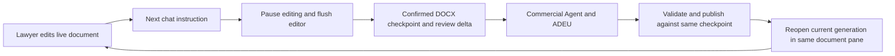

# LQ Commercial Redlining MVP — discovery and implementation plan

Status: **Stage 2A implemented; native open/type/save/close/reopen verified; awaiting the user's hands-on checkpoint before stage 3A.** The independent legal bundle uses three narrow Harness extensions for generation, Client packaging and deferred tab close. The agent loop, Desktop launcher and root dependency lock remain unchanged. Source discovery was completed on 1 October 2026. The 6 October Windows handoff supersedes the 2 October Web-first route. This is the single current implementation plan; [WINDOWS_HANDOVER.md](WINDOWS_HANDOVER.md) provides continuation instructions. Current machine observations are recorded in [Windows baseline evidence](#windows-baseline); [the stage-2A checkpoint](#stage-2a-checkpoint) records current behavior and testing steps.

**Recommendation and the decision to approve**

Build a shared Harness integration that owns one continuing document session, displays a live Collabora CODE editor beside chat, and calls the pinned ADEU Node SDK for tracked amendments. Develop and test directly in Harness Desktop on the user's personal Windows PC, using its ordinary supported Windows launch path. Collabora supplies the interactive LibreOffice-based editor. Harness keeps its chat, sessions, permissions, model connection and extension mechanisms. The application coordinates the document automatically when the lawyer sends the next instruction.

**Windows Desktop is the primary development and acceptance environment.** Linux platform support, Linux Desktop launcher changes, Wine, Xvfb and Linux runtime-target workarounds are outside this MVP. A preliminary Web implementation or separate Web acceptance milestone is no longer required. Use Harness's shared client/host extension points for the coordinator, ADEU adapter, skill and playbook; use Web only if useful for a bounded diagnostic. Do not create a replacement chat application. Signed installers, updater work and enterprise deployment are unnecessary for the personal Windows experiment.

The critical proof is the repeated human–agent loop, including unsaved editor state, resolved revisions and export. Neither inspected Harness nor the LQ fork already meets that complete requirement. Run the full substantive acceptance sequence inside Windows Desktop. Native launch, repository workspace selection, existing DOCX preview and a live-model chat are now observed on the user's PC. The redlining integration and substantive editing acceptance remain pending.

**Verified environment, repositories and discovery assignments**

Discovery ran on a Debian 12 x86_64 laptop, not Windows. Its old resource measurements, local paths and installed tools are not Windows prerequisites. Existing LQ services and user modifications were preserved. The personal Windows PC has now been inspected; use the [recorded baseline evidence](#windows-baseline) to continue normal upstream Desktop setup. Do not repeat Linux compatibility discovery.

| Project | Inspected checkout and state | Pinned revision / relevant versions |
|---|---|---|
| DeepSeek Harness | Official upstream `master` inspected during discovery; this repository is based on the same pinned source and retains its upstream Git history | tag `dsh-v0.2.0-rc.2`; Desktop 0.2.0-rc.2; lockfile Electron 44.0.0; pnpm 11.7.0 |
| ADEU | Official `main` inspected in an isolated checkout; source is a reference, not copied into this handoff | `965736d2d8ea32f42ed9a2a0a01b3c5a538f7f75`; Python `adeu` and Node `@adeu/core` both 3.0.6 |
| LQ fork | Verified user fork `sarturko-maker/lq-ai-fork`, `main`; tracked source was clean; reference only | `82904157a155ad2926e4ba64447087f7ef1cdb45`; current ADEU pin 2.4.0; Collabora CODE 26.04.1.4 |

On 1 October all three repository HEADs matched the inspected commits after network access was granted. Harness's upstream branch is `master`; the handoff branch is `main`. Two older ADEU checkouts were identified before using 3.0.6. Eleven pre-existing untracked paths in the LQ fork were left untouched and are not included here. Temporary discovery checkouts are not required for continuation: use the pinned source references below. On 6 October the Harness tag was cloned again and its exact commit verified before preparing this handoff.

Applicable home/repository instructions were read, including Harness's scoped instructions and the fork's CLAUDE.md and HANDOFF. The explicit discovery-only brief governs this work; no legacy memory workflow or unrelated LQ application requirements were imported.

During the 1 October discovery, model selection was verified in both configuration and actual session metadata: the orchestrator ran on `gpt-6-astra`, reasoning `max`; each of the three named discovery agents ran on `gpt-6-luna`, reasoning `high`. Explicit spawn parameters selected those models. No main-session model switch was attempted. The available model catalogue describes Astra as the frontier model and Luna as the cheaper model for bounded work. The requested [Codex best practices](https://learn.chatgpt.com/guides/best-practices) and [subagent guidance](https://learn.chatgpt.com/docs/agent-configuration/subagents) were consulted. Findings below consolidate all three reports and the orchestrator's independent checks.

**What the projects actually provide**

| Project | Implemented capabilities and evidence | Missing for this MVP |
|---|---|---|
| Harness | Electron wraps the shared Harness application. Workspaces, ordinary sessions, agent presets, filesystem skills, client slots, host routes and turn hooks already exist. DOCX is converted to PDF in the right sidebar. [Desktop](https://github.com/deepseek-ai/deepseek-harness/blob/dsh-v0.2.0-rc.2/apps/desktop/README.md), [preview](https://github.com/deepseek-ai/deepseek-harness/blob/dsh-v0.2.0-rc.2/packages/client/ui-sidebar-documentpreview/README.md#L28), [skills](https://github.com/deepseek-ai/deepseek-harness/blob/dsh-v0.2.0-rc.2/packages/skill/skill-filesystem/README.md) | Interactive Word editing, revision management, editor-to-turn handover and review continuity. A rendered PDF is neither an editable DOCX nor an accept/reject interface. The preview adds no document context to the model. |
| ADEU | Reads the original DOCX package, projects text/revisions/comments for the model, and applies targeted edits as native OOXML tracked changes. Node exports `DocumentObject` and `RedlineEngine`; `process_batch` supports transactional failure handling. [Exports](https://github.com/dealfluence/adeu/blob/965736d2d8ea32f42ed9a2a0a01b3c5a538f7f75/node/packages/core/src/index.ts), [package load/save](https://github.com/dealfluence/adeu/blob/965736d2d8ea32f42ed9a2a0a01b3c5a538f7f75/node/packages/core/src/docx/bridge.ts#L158), [batch API](https://github.com/dealfluence/adeu/blob/965736d2d8ea32f42ed9a2a0a01b3c5a538f7f75/node/packages/core/src/engine.ts#L4878) | Live editor coordination, turn ownership, stale-write prevention and a durable account of human review outcomes. It cannot see unsaved Collabora state. |
| LQ fork | A Collabora iframe beside chat; WOPI reads/saves; native redlines; saved-byte rereading; file locks, timestamp/hash checks and snapshots. A hand-back button requests a save, closes the editor and primes chat. [Editor](https://github.com/sarturko-maker/lq-ai-fork/blob/82904157a155ad2926e4ba64447087f7ef1cdb45/web/src/lib/lq-ai/components/matter/DocumentEditorPanel.svelte#L483), [WOPI](https://github.com/sarturko-maker/lq-ai-fork/blob/82904157a155ad2926e4ba64447087f7ef1cdb45/api/app/api/wopi.py#L419), [document reread](https://github.com/sarturko-maker/lq-ai-fork/blob/82904157a155ad2926e4ba64447087f7ef1cdb45/api/app/agents/review_edited_document_tools.py#L267) | Ordinary chat does not automatically flush the editor. No explicit accept/reject action journal exists. Editing is not exclusively coordinated with an agent run. Download returns stored bytes, so an unsaved editor still needs a barrier. |

Harness's separately packaged LibreOffice Kit is a conversion provider. Its browser-worker replacement rejects converter creation; neither is a hidden interactive editor. See [conversion limitations](https://github.com/deepseek-ai/deepseek-harness/blob/dsh-v0.2.0-rc.2/packages/document/office-to-pdf/README.md) and [worker stub](https://github.com/deepseek-ai/deepseek-harness/blob/dsh-v0.2.0-rc.2/packages/experimental/webworker-runtime/src/node/external_packages/libreoffice-kit.ts).

ADEU's Node SDK is the recommended integration: version 3.0.6 requires Node 22 or later, already covered by Harness's stronger runtime requirement, and adds only `fflate` and `diff-match-patch` as runtime dependencies. Use its existing projection, change/comment readers and engine; do not introduce MCP's separate document/session lifecycle or reconstruct the contract from flattened text. Explicitly set the agent author and use `partial=false`. Engine-local `Chg:N`/`Com:N` references must be regenerated from each current document, not retained as durable identities. [Manifest](https://github.com/dealfluence/adeu/blob/965736d2d8ea32f42ed9a2a0a01b3c5a538f7f75/node/packages/core/package.json), [existing-comment regression](https://github.com/dealfluence/adeu/blob/965736d2d8ea32f42ed9a2a0a01b3c5a538f7f75/node/packages/core/src/engine.comment-preservation.test.ts).

Fidelity is qualified, not universal. ADEU serializes XML package parts on save; byte-identical XML is not a valid general preservation promise. Text boxes/SmartArt are absent from its projection, some objects are read-only, comments are restricted to the main story, and URL retargeting is not tracked. Existing opaque content must survive, and the agent must be told about unread or unsupported regions. Initially exclude agent operations such as silent URL retargeting that cannot meet the tracked-amendment requirement. [ADEU fidelity contract](https://github.com/dealfluence/adeu/blob/965736d2d8ea32f42ed9a2a0a01b3c5a538f7f75/docs/FIDELITY.md).

The fork provides useful patterns, not components to import wholesale: iframe lifecycle, WOPI version checks, snapshot-before-write, and rereading current marked-up bytes. Its matter roster, gateway, memory, database, audit framework and authentication stack are unnecessary here. Source is more reliable than its older proposals: the current editor sends `Action_Save` without `Notify:true`, and its save-state helper can treat a non-error response as saved. That is insufficient evidence for our handover barrier. [Save-state helper](https://github.com/sarturko-maker/lq-ai-fork/blob/82904157a155ad2926e4ba64447087f7ef1cdb45/web/src/lib/lq-ai/api/editor.ts#L98).

**Windows Desktop integration and editor arrangement**

Use the existing shared right-sidebar tab/slot extension points for a stable, session-owned editor pane beside chat in Harness Desktop. Reuse the layout, but give the live editor its own lifecycle: the PDF preview's automatic file reload must not remount an iframe with unsaved work. One Commercial Agent preset loads the commercial skill and selected Markdown playbook. A host plugin owns the working-document session, ADEU tools, WOPI adapter and handover. Keep integration code on Harness's shared client/host interfaces, adding Desktop-specific wiring only where an observed integration requirement needs it. There is no replacement chat, new account system or long-term memory service.

Run one isolated, pinned Collabora CODE service for this experiment. Start with image digest `sha256:75859dc9f9084d1877ce36cf96ec86600f495bade33289c9cbc27e0a0ee23b81` (26.04.1.4), whose running version was verified in the old LQ environment. Prepare a separate instance on Windows using a suitable Linux-container runtime; do not depend on the old laptop's running stack. Embed the live editor inside Harness Desktop using an application-owned local wrapper/bridge. Collabora must explicitly allow the configured embedding origin; validate postMessage origin and source. Preserve Electron's sandbox, context isolation and web security.

Collabora's browser assets and WebSocket paths need real HTTP routing; Docker must also reach the WOPI callback endpoint. Use Harness's existing host route mechanisms and add only the narrowly scoped editor/WOPI bridge they require, without exposing the entire Harness host. Use WOPI's scoped document capabilities and version checks, not new user accounts. Verify native Windows host/container routing, iframe communication, Desktop's authenticated `dsh-app://app` forwarding and late-save fencing directly in Desktop. These are requirements of embedding the live document editor, not reasons to alter upstream Windows launch or build-target support. Keep any necessary configuration or adapter small. Existing [host route APIs](https://github.com/deepseek-ai/deepseek-harness/blob/dsh-v0.2.0-rc.2/packages/host/webserver/src/index.ts#L38) and the fork's [real asset/WebSocket findings](https://github.com/sarturko-maker/lq-ai-fork/blob/82904157a155ad2926e4ba64447087f7ef1cdb45/docs/fork/evidence/libreoffice-slice4/README.md) support this approach; exact deployment wiring remains a Phase 1/2 verification item.

The earlier Linux Desktop limitation is historical context only. `dev.ts` calls a target resolver that rejects `linux-x64`; the orchestrator reproduced that error during discovery. The selected Windows x64 target is supported. Leave the launcher and resolver unchanged and start with `pnpm run dev:desktop` on native Windows. [Rejecting resolver](https://github.com/deepseek-ai/deepseek-harness/blob/dsh-v0.2.0-rc.2/apps/desktop/scripts/desktop-build-paths.mjs#L7), [development call](https://github.com/deepseek-ai/deepseek-harness/blob/dsh-v0.2.0-rc.2/apps/desktop/scripts/dev.ts#L115).

Native LibreOffice window embedding would add platform-specific integration with no equivalent implemented Harness path; external launching loses the integrated experience; Harness's conversion kit provides preview only. The chosen route is development and acceptance directly in Windows Desktop. It requires real interactive editing alongside chat; a CLI-only test, static preview or external editor does not satisfy the GUI milestone.

**Automatic awareness and safe handover**

Preserve the original byte-for-byte and create an application-owned working copy. The lawyer sees one stable document name/tab. Checkpoints and editor generations remain internal. The coordinator is the only writer to the managed document; the Commercial Agent's general tools must not bypass it or write the original. Use Harness's existing permission mechanisms for this restriction.



The proposed handover is automatic:

1. **Gate the turn.** On the next lawyer instruction, pause document editing visibly and drain pending input. Capture active text composition and comment editing as well as changes already in the LibreOffice model. The host must withhold document-dependent model/tool work until this succeeds. Human editing alone never starts an agent task.
2. **Flush and confirm.** Request an editor save with notification and wait for a successful, correlated save plus the host's durable WOPI checkpoint. A timer, an old file modification time or a `dirty=false` notification alone is insufficient. Handle a no-change save explicitly. If the editor changes during flushing, repeat the barrier before taking the checkpoint.
3. **Transfer ownership.** Once the latest bytes are preserved, retire/fence the editor generation and acquire the agent's exclusive document lease. Do not leave an old in-memory Collabora document able to overwrite the new output. Keep editing paused during the agent turn for the first MVP; show progress and cancellation.
4. **Supply current context automatically.** Read that exact DOCX through ADEU and provide current text, outstanding revisions/comments, the human delta and prior review outcomes with the lawyer's instruction. Record model-visible context through Harness's normal session logging. `agent/pre-step` is the existing admission seam; it runs at multiple steps, so the plugin must scope acquisition to the requested turn and reuse its lease thereafter. System assembly precedes this hook: inject the current document into the admitted message batch, not a system-prompt provider that has already run. [Actual hook order](https://github.com/deepseek-ai/deepseek-harness/blob/dsh-v0.2.0-rc.2/packages/core/agent-loop/src/agent.ts#L267).
5. **Prepare, check and publish.** ADEU works on a staged copy of the checkpoint. Validate the complete batch, DOCX integrity, preserved protected content and expected revisions/comments. Publish only if the document hash and ownership generation still match. On a mismatch, preserve both states and refresh/re-plan; never apply an old patch blindly.
6. **Return the same document.** Open the committed generation automatically in the same pane, verify it loaded the expected version, then restore editing. Internal WOPI identities may change to avoid a cached old document, but the lawyer must never select a version or open a numbered output. Restore location where practical; retain checkpoints because editor undo history may reset across reloads.

On save timeout or editor failure, leave unsaved work in the editor and stop the dependent turn; preserve the chat instruction. On ADEU/model failure, keep the last human checkpoint. On a late old-generation save, retain its bytes for recovery and reject publication to the working head. On reload failure, keep the committed output and previous checkpoint and show a retryable error. Closing the document or exporting uses the same save barrier. A crash cannot guarantee recovery of keystrokes never delivered anywhere; the application must report the last confirmed checkpoint rather than claim synchronization.

**Human review decisions need their own session evidence**

A current DOCX by itself is inadequate. Retain each agent proposal's before/after wording, affected document part and contextual anchors, revision grouping, author and baseline checkpoint *before* exposing it for review. At each handover, reconcile this ledger against the newly captured DOCX, including untracked human edits and comments. Do not identify a proposal solely by an OOXML or ADEU numeric ID: LibreOffice can renumber or regroup revisions.

For an unambiguous proposal, retained proposed wording with the corresponding revision resolved is an **accepted outcome**; restoration of its prior wording with the proposal gone is a **rejected outcome**. Label these as outcomes established from observed before/after state, not invented evidence of a particular button click. A changed or partially resolved proposal becomes **human-modified/resolved, exact action uncertain** when the evidence does not support a stronger conclusion. Undo/redo must reconcile the current outcome rather than preserve a stale rejection flag.

This approach uses both the earlier proposal and later editor state: it does not ask the model to infer decisions from current wording alone. Import/re-save normalization needs its own baseline so it is not mistaken for a lawyer decision. Track history only from the observed session; pre-existing revisions arrive as pending/unknown history.

All human-modified or resolved spans are protected by default, including uncertain cases. Give the agent this evidence on every relevant turn; prevent automatic replay of retired proposals and check candidate patches against protected spans. A later explicit instruction may supersede a decision. Only an actual conflict that cannot be resolved from that instruction should require clarification; uncertainty elsewhere must not turn routine handover into a dialogue.

**This reconciliation is a feasibility gate, not an already proven capability.** Test accept, reject, partial resolution, manual rewriting, unchanged wording after rejection, renumbering, duplicate text and undo/redo. The fork has no reliable accept/reject event feed. Collabora's current [WOPI handler](https://raw.githubusercontent.com/CollaboraOnline/online.mirror/main/browser/src/map/handler/Map.WOPI.js) supports notified saves and UNO dispatch, but that does not establish a stable decision log in the pinned build; its public [UNO result issue](https://github.com/CollaboraOnline/online/issues/8903) also leaves this uncertain. If outcome reconciliation cannot reliably protect the mandatory journey, a small pinned editor observation adapter must be evaluated before proceeding. Do not substitute guessed action history, a manual change summary, or a weaker acceptance test.

**Skill, playbook, scope and data handling**

Use one reusable commercial `SKILL.md` through Harness's filesystem skill provider, plus an editable Markdown example playbook. It will define review positions and cite its selected reviewing party/stance separately from integration instructions. For the synthetic demonstration, propose an explicitly labelled customer-side, balanced playbook covering liability and indemnity plus one simple secondary clause. The UI/session records that selection; real reviewing positions must be provided rather than inferred. Playbook edits take effect without rebuilding and are captured at the start of a turn.

The skill requires current-document tools, minimal genuine tracked amendments, preservation of human decisions and escalation of real conflicts. It must not reconstruct contracts from plain text, accept all changes, or silently produce a clean copy. Start with tracked DOCX export only; a clean-copy feature is unnecessary for the MVP. Enable and verify human change recording in the editor, but also detect untracked edits rather than depending on the recording flag alone. Use distinct agent and lawyer authors where the document format/editor preserves them.

No additional legal agents, matter management, retrieval, email, long-term memory, authentication system, analytics, telemetry or Linux platform-support work are proposed. Normal Harness session persistence remains intact. The session ledger/checkpoints exist only for document coordination and recovery. Small modules should normally stay around 200 hand-maintained lines; keep any necessary larger protocol/state-machine module cohesive and explain the exception.

Document processing and Collabora run locally; the Commercial Agent's document text, comments and instructions go to the selected model service. The recommended first smoke uses Harness's existing DeepSeek connection, whose official API root in this checkout is `https://api.deepseek.com/anthropic`; account/custom routes must be identified if selected instead. This is not an offline application. Harness also has existing optional session-log upload, enabled by default in shipped profiles. Record/configure those existing controls for the test profile; add no new collection. [Provider](https://github.com/deepseek-ai/deepseek-harness/blob/dsh-v0.2.0-rc.2/packages/llm/llm-deepseek/README.md#L82), [session-log setting](https://github.com/deepseek-ai/deepseek-harness/blob/dsh-v0.2.0-rc.2/packages/session/session-log-deepseek/README.md#L28).

Harness and ADEU are MIT; LQ code is Apache-2.0, with notices retained for any narrow reuse. Collabora source and its LibreOffice core have open-source licence obligations; official CODE binaries, branding and third-party components need their own terms checked. The publisher presents CODE for development/testing, which fits the local experiment. Keep its notices/branding intact and install the pinned image as a prerequisite rather than bundling it in a GitHub handoff. The fork's notices are not independent clearance for binary redistribution or enterprise production. Applicable terms for a corporate sandbox and any later distribution remain a Phase 4 check. [Collabora source licence](https://github.com/CollaboraOnline/online/blob/main/COPYING), [LibreOffice licensing](https://www.libreoffice.org/licenses/), [publisher's CODE page](https://www.collaboraonline.com/de/code/), [publisher's binary-licensing discussion](https://forum.collaboraonline.com/t/code-binary-license/179).

**Phases, observable outcomes and acceptance**

| Phase | User-visible outcome | Work and verification | Acceptance criteria |
|---|---|---|---|
| **1 — Establish the native Windows Desktop baseline** | Unmodified Harness Desktop opens on the personal Windows PC; ordinary chat, workspace selection and existing DOCX preview can be inspected before adding editing. | Inspect Windows/architecture and normal prerequisites. Use this pinned checkout, supported Node/pnpm and the existing `dev:desktop` command. Record actual GUI launch, model connection, file access and any pre-existing failure separately. Prepare the isolated Collabora prerequisite when needed for Phase 2. | Native Windows Desktop launch, workspace open and baseline preview observed. Model connection evidence is separate from keyless checks. No Linux adaptation, Web-first requirement, signing or packaging work. Existing permission controls and ordinary sessions remain intact. |
| **2 — Prove the complete editing round trip in Desktop** | Chat and the live editable contract remain side by side in Desktop; the next instruction automatically hands current human work to the agent and returns the continuing document. | Add small shared client/host plugins, coordinator, local Collabora/WOPI bridge, ADEU adapter, skill and playbook. First run controlled amendments through real ADEU and the real embedded editor. Prove notified durable saving, review-outcome reconciliation and old-session fencing early. Then use the live Commercial Agent with a synthetic contract. | At least three agent turns: first redline; substantive human edit + accept + reject + comment without manual save; dependent indemnity instruction; another human edit and agent turn; tracked export and reopen. Rejected proposals stay rejected by default, human wording/comments and outstanding revisions survive, and the original hash is unchanged. Record native Windows Desktop and live-model evidence. |
| **3 — Reliability and your personal Windows test** | You can perform the complete journey on your personal Windows PC and recover from a failed handover without losing work. | Add focused deterministic regressions, real ADEU/Collabora preservation tests and failure injection. Independently review document safety and handover. Exercise Windows focus/keyboard, file dialogs, export paths and editor/container routing. Give concise test steps, observe your personal test, fix issues and repeat affected checks. | Relevant checks and the full hands-on Desktop acceptance test succeed after fixes. Separate automated, GUI and live-model evidence. Ordinary redlining downloads no packages. A mocked editor notification or successful first redline cannot establish acceptance. |
| **4 — Reproduce and prepare the later corporate handoff** | A clean Windows checkout reproduces the accepted workflow; the repository explains what a later corporate sandbox needs. | Verify setup in a clean native Windows checkout using the same versions. Maintain this plan, setup instructions and coherent commits. Record notices and dependency prerequisites. Document corporate container/virtualization and network requirements separately; exercise that environment only when available. | Clean-checkout setup and the accepted native Windows journey are reproducible. Record OS/build/revision and all untested environments. Personal Windows success does not establish corporate sandbox or macOS compatibility. Git excludes credentials, real documents, generated outputs and machine-specific runtime paths. Signed installers and enterprise infrastructure are unnecessary. |

The initial GitHub source-and-plan handoff is authorized now; it does not mean Phase 4 product reproducibility or acceptance is complete. After implementation approval, use a feature branch and review each increment's diff and relevant checks. Keep parallel implementation work disjoint. Independently review the completed workflow for lost edits, stale state, review continuity and export. Do not defer actual Desktop testing: Windows is available as the next development environment. macOS and a separate Web acceptance run are not required for this personal Windows MVP.

**Verification matrix and outstanding risks**

| Behaviour | Required evidence |
|---|---|
| Original and native revisions | SHA-256 of the untouched original; actual ADEU-produced `w:ins`/`w:del`; editor visibly displays revisions; distinct human/agent authors checked. |
| Existing document content | Synthetic corpus with pre-existing revisions/comments, mixed run formatting, numbering, tables, headers/footers, fields, links and an embedded image. Assert semantic/structural preservation and inspect representative layout after repeated actual saves. Unsupported complex constructs are surfaced, not silently stripped. |
| Current unsaved human state | Real editor typing immediately before ordinary chat submission, including active composition/comment handling; verify the checkpoint and model's supplied context contain it without a manual save. |
| Review decisions | Accept one proposal and reject another; verify the next turn's ledger and output. Include reject-to-original wording, partial changes, untracked edits, duplicate spans, renumbering and undo/redo. Never equate a missing revision ID alone with rejection. |
| No lost edits | Attempt typing during preparation, delayed/duplicate WOPI saves, stale hash, a second session opening the same working document and external modification. One writer owns the document; competing bytes survive and cannot silently replace the head. |
| Failures | Save failure/timeout, interrupted connection, unavailable renderer, failed ADEU batch, model cancellation/failure, stale writer and reload failure. Keep a usable checkpoint, pending instruction and honest state indication. |
| Continuity/export | At least three rounds, then export with another unsaved edit. Reopen the exported DOCX in the interactive editor and independently inspect its text, remaining revisions/comments and original hash. Export never invokes accept-all. |
| Actual agent behaviour | Separate live-model run showing the indemnity uses the lawyer's current liability provision and obeys recorded review outcomes. Deterministic document tests do not establish model compliance. |
| Windows Desktop acceptance | Execute the complete substantive journey inside actual Harness Desktop on the personal Windows PC. Record OS/build, integration revision, model service and engine versions, including file/origin/permission behaviour. Automated, live-model and hands-on GUI evidence remain distinct. Web tests, if used diagnostically, do not replace this acceptance. |

Complex DOCX preservation is still unproven for the chosen ADEU 3.0.6 + CODE 26.04.1.4 pairing. The fork records four headless Collabora round-trip fixtures using ADEU **1.12.1**, plus a later real WOPI edit/save demonstration. Its hand-back test injected an editor status and explicitly did not run the full provider-backed resumed workflow. Those historical results justify trying Collabora but do not pass this plan's gates. [Old fidelity evidence](https://github.com/sarturko-maker/lq-ai-fork/blob/82904157a155ad2926e4ba64447087f7ef1cdb45/docs/fork/evidence/libreoffice-spike0/README.md), [hand-back test limits](https://github.com/sarturko-maker/lq-ai-fork/blob/82904157a155ad2926e4ba64447087f7ef1cdb45/docs/fork/evidence/libreoffice-slice5/SUMMARY.md).

During 1 October discovery, environment/repository checks and the Desktop target-resolver probe ran. An ADEU Python regression attempt stopped during collection because `rapidfuzz` was absent; it is not a pass. Node tests, the current ADEU–Collabora round trip, live-agent tests and GUI acceptance were not run. The 2 October Web route is superseded by the 6 October Windows handoff. No implementation or Windows launch occurred while preparing the handoff. Source inspection does not establish a passed test.

The Collabora SDK site was inaccessible behind its bot-check page. Public source from Collabora's mirror established available protocol concepts, but the pinned image's precise save/close behaviour still needs the Phase 2 empirical check. Review-outcome mapping, browser draft flushing, old-session fencing and document fidelity are the highest-priority gates. They cannot be deferred until packaging.

**What you will need on the personal Windows PC**

Use native Windows x64, Git, a supported Node runtime (the checked-in Harness runtime lock pins Node 24.21.0) and pnpm 11.7.0. Follow [the Windows handover](WINDOWS_HANDOVER.md), [upstream setup](docs/development.md#setup-tutorial) and [Desktop development](apps/desktop/README.md#develop). Keep the checkout and its dependencies on the Windows filesystem. Use the normal upstream Desktop development command and its isolated development profile. Do not set up Harness inside WSL or add Linux launch support. Any native build prerequisite should follow an actual upstream requirement or installation diagnostic, not speculative platform changes.

Collabora CODE remains a separate integration prerequisite: normal Harness Desktop has document preview, not this interactive contract editor. Use a suitable local Linux-container runtime such as Docker Desktop, with its normal virtualization/backend prerequisites. WSL may be used by that container backend; this does not move Harness development into Linux or authorize Linux Desktop support. Use a dedicated experiment container, pin the image and verify its callback access to the native Windows host. ADEU Node needs neither an additional Python service nor a standalone host LibreOffice installation. Prepare packages and editor dependencies during setup, before ordinary redlining.

You will need an existing Harness model connection and a synthetic DOCX. Configure credentials through normal local controls; never place them in this repository. The example playbook must explicitly identify the reviewing party and stance. The full personal test includes the unsaved edit/accept/reject/comment sequence, the dependent chat instruction, another editing round, and export/reopen. No manual save, synchronization, intervention summary or version selection is allowed. All those GUI steps remain pending.

The next machine is the user's **personal Windows PC**, not the corporate sandbox. Corporate prerequisites and licensing are a later handoff concern. When that separate test is scheduled, verify whether its sandbox permits the required container runtime, virtualization and networking; do not assume Windows Sandbox permits nested Docker/WSL. Docker's [Windows installation requirements](https://docs.docker.com/desktop/setup/install/windows-install/) are the starting reference, with current terms to be checked at setup. A remote editor service requires a separately approved choice and explicit data-flow implications. Do not add corporate deployment infrastructure to the personal experiment.

**Authorization and progress**

| Item | Status |
|---|---|
| Three source discovery reports, configuration verification and consolidated architectural review | Complete on 1 October |
| Direction: native Desktop development and testing on the personal Windows PC | Confirmed by the user on 6 October; supersedes the Web-first route |
| Handoff destination | `https://github.com/sarturko-maker/deepseek-legal`; push authorized by the user; already public when inspected; visibility left unchanged |
| Pinned upstream Harness source and Windows continuation instructions | Prepared for the authorized handoff; product source remains unchanged |
| Linux Desktop adaptation, mandatory Web-first work, platform workarounds | Excluded |
| Incremental Windows implementation | Authorized by the user's instruction to continue from the handover; propose the exact next work item before edits |
| Phase 1, native Windows baseline | Launch, native repository selection, DOCX preview and live-model chat passed on `feat/windows-desktop-baseline`; see [evidence](#windows-baseline) |
| Phases 2–3, integration and personal Windows acceptance | Document engine and guarded storage implemented in the optional legal bundle; embedded editor and complete acceptance pending |
| Phase 4, clean Windows reproduction and corporate sandbox verification | Not completed |

<a id="windows-baseline"></a>

**Windows baseline evidence — 6 October 2026**

This increment verifies Phase 1 through the existing native Desktop launch path. Tracked changes cover this plan, the Windows handover and a credential comment in `.gitignore`. The user's follow-up requested an ignored key placeholder; it lives in the isolated Desktop development home. Application source and dependency pins remain at the handoff baseline. The checkout was clean on `main` before creating `feat/windows-desktop-baseline`; `origin` points to the user-designated repository over SSH.

| Inspection or command | Observed result |
|---|---|
| Native OS | CIM reports Windows 11 Home, 64-bit, version `10.0.22631`; registry reports 23H2, build `22631.5039`. The registry's legacy product label says Windows 10; use the CIM caption. |
| `node --version`, `corepack --version`, `git --version` | Node `v24.19.0`, Corepack `0.35.0`, Git `2.53.0.windows.1`. Node satisfies the repository engine range; the bundled runtime pin remains `24.21.0`. |
| Initial local setup | No `node_modules`, root `.env`, `DEEPSEEK_API_KEY` or `DEEPSEEK_BASE_URL` in the command environment. This does not inspect credentials in another application's profile. |
| `corepack enable` | Failed with `EPERM` under `C:\Program Files\nodejs` both inside the sandbox and after host escalation. |
| `corepack pnpm --version` | Passed after host escalation allowed Corepack's user-cache write; reports `11.7.0`. Direct Corepack invocation avoids requiring global shims. |
| `corepack pnpm install --frozen-lockfile` | Passed with pnpm `11.7.0`; the lockfile remains unchanged. Install reported platform/cyclic-workspace warnings and missing unbuilt `dsh` bin targets; postinstall completed. |
| `corepack pnpm run typecheck` | Passed: Host compilation/bundling and Client compilation completed. |
| `corepack pnpm run dev:desktop` | Application build passed; launch preparation failed while downloading Electron with `TypeError: fetch failed`. |
| `corepack pnpm --dir apps/desktop exec install-electron` | Retry passed; the pinned Electron `44.0.0` executable is present. |
| `corepack pnpm run start:desktop` | Native Electron application opened at `dsh-app://app/`. Locked runtime preparation and its Office document round trips passed; payload versions are Node `24.21.0`, Python `3.12.14`, pnpm `11.7.0`. |
| `corepack pnpm run lint:contracts-ready` | Passed against the completed build. |
| `corepack pnpm run test:docs` | Initial run: 20 passed, 1 failed because the handover included raw Harness commit references. Replaced them with the upstream release tag after `git ls-remote --tags` confirmed the identical source revision; focused `verify-repository-references` rerun passed. |
| `corepack pnpm run doc-sync` | 41 passed, 2 failed: doc graphs exhausted the default 2 GB Node heap; one documentation-site test failed with `EPERM` when creating a file symlink on Windows (150 other site tests passed). |
| `corepack pnpm exec node --max-old-space-size=4096 --import tsx/esm scripts/gen-doc-graphs.ts --check` | Passed: all 7 graph documents are current. The Windows file-symlink test remains unresolved. |
| Desktop onboarding and workspace | Used the existing Set up later flow while the key placeholder was empty. The real native Select Folder dialog selected `C:\Users\tishi\deepseek-lq`; the workspace and Files pane display that directory. |
| Existing DOCX preview | Opened `packages/bundle/web-app/tests/fixtures/document-conversion.docx` through the Desktop file tree. The Office-to-PDF preview visibly displays “Office preview ready”; a rendered canvas is present. The fixture still matches its committed Git blob. |
| GUI evidence | Local screenshots and bounded inspection scripts are under ignored `tmp/windows-baseline/`. Inspection used the launcher's existing renderer debugging port and Windows native picker controls; no Web application was launched separately. |
| Model connection | After the user populated the ignored development-home `.env`, a presence-only check returned true. Quit through Electron's normal application lifecycle and relaunched with `corepack pnpm run start:desktop`; the workspace and DOCX preview persisted. The UI selects `DeepSeek-V41-Flash`, reasoning High. |
| Session-log setting | Inspected Settings → General before the live request. “Upload Session Log when using the official model API” is enabled; the existing setting was left unchanged. |
| Live Desktop chat | Submitted “Reply with exactly DESKTOP_BASELINE_OK. Do not use tools or read files.” through the ordinary composer. The completed turn displays exactly `DESKTOP_BASELINE_OK`; the UI reports 1 turn and 1 step. This verifies the model connection, not legal reasoning or document editing. |
| Edited-document checks | Focused relative-link/anchor, paragraph-wrap and final-newline checks cover both root handover documents; `git diff --check` checks the tracked diff. |

The `tsx` launcher failed inside the sandbox with `uv_os_get_passwd` returning `ENOMEM`; host-level execution allowed the documentation checks to run. The remaining symlink failure also occurred outside the sandbox. Developer Mode and machine-wide privileges have not been changed.

The ignored credential file is `apps/desktop/.desktop-build/development/home/.env`. The user populated the key immediately after `DEEPSEEK_API_KEY=` on line 2; Desktop was restarted. The native development launcher supplies this directory as `DSH_HOME`, and the existing credential loader reads its `.env`. `git check-ignore -v` and `git ls-files --error-unmatch` confirmed that the file is ignored and untracked. Do not print or commit its contents. The selected default model API is `https://api.deepseek.com/anthropic`; its existing session-log upload setting was observed enabled before the successful live test.

Desktop remains open on the repository workspace with the completed “Desktop baseline OK test” session and synthetic DOCX preview. The initial launcher reported an unregistered `dsh-desktop:mandatory-status` handler during startup and Electron's development CSP warning; onboarding, workspace selection and preview nevertheless succeeded. The live chat establishes the model connection. The legal bundle's separate implementation evidence follows; the full human–agent editing journey remains unimplemented.

<a id="staged-implementation"></a>

**Staged implementation and packaging — 6 October 2026**

The user requested staged implementation, maintainable upstream updates and a GitHub checkpoint. Keep the legal integration in the independent [legal bundle](legal/README.md), with its own manifest, lockfile and build. The fork retains its pinned Harness development baseline and root dependency lock. Stage 2A adds optional package-directory and manifest selection plus deferred sidebar close; ordinary callers retain their existing behavior. Install the final bundle through Harness's existing profile/plugin mechanisms. Signed installers and packaging Collabora into the application are outside this personal Windows MVP; the editor is a separately pinned local prerequisite.

| Stage | Files and purpose | Verification and current status |
|---|---|---|
| 1 — Bundle and tracked document engine | `legal/package.json`, configuration and lockfile own the separate distributable. `legal/src/document.ts` wraps ADEU 3.0.6; `store.ts` owns an immutable original and guarded working head; `index.ts` registers open/read/redline tools through existing Harness services. `legal/tests/` owns focused engine, storage, Loader and artifact checks; `legal/README.md` owns package behavior and update instructions. | Implemented. The current legal suite includes the original engine/storage cases and stage-2A tests. Native Desktop loads the bundle; real model open/read operations were exercised. The portable keyless snapshot pins the legal tool header and unopened-contract response, not the full amendment journey. |
| 2 — Local editor and Desktop pane | `legal/editor/compose.yml` pins CODE; the optional editor patch and `legal/src/editor/` provide authenticated launch and document-scoped WOPI callbacks. `legal/src/client/` owns the preview action and retained sidebar pane. The document store holds its writer lock throughout editing. | Stage 2A implemented on 10 October. Actual native typing survived notified save, close and reopen; the saved DOCX hash and immutable original were independently checked. Review controls are available. The real ADEU–CODE round trip passes. Await the user's checkpoint before automatic handover. |
| 3 — Automatic editor/chat handover | Extend the document coordinator and client bridge with correlated save acknowledgement, durable checkpointing, paused editing, writer-generation fencing and automatic reload. Add the Commercial Agent skill, preset and editable playbook through the bundle. Record current context and review outcomes through existing logged interfaces. | Pending. Add deterministic lifecycle, failure and permission tests plus a keyless recorded-session scenario through a shipped profile. A chat test alone cannot pass this stage. |
| 4 — Complete native editing acceptance | Add synthetic preservation fixtures and real ADEU–CODE round trips; exercise typing, accept, reject, comments, three agent rounds, tracked export/reopen and original hash preservation inside Desktop. | Pending. Separate automated, live-model and user hands-on evidence. Independent safety review and affected regression checks precede acceptance. |
| 5 — GitHub and upstream-update qualification | Maintain coherent checkpoint commits in `sarturko-maker/deepseek-legal`, add bundle CI and clean-checkout reproduction, then qualify deliberate Harness updates against the engine/editor/Desktop tests. | Document engine, WOPI backend and real editor tests pushed and remote branch verified on [feat/legal-redlining](https://github.com/sarturko-maker/deepseek-legal/tree/feat/legal-redlining) on 9 October. The push's Host build and Client typecheck passed. HTTPS uses the existing Git Credential Manager account; the push URL is saved locally after SSH authentication failed. CI and full update qualification remain pending. Do not publish credentials, local sessions, dependencies or generated artifacts. |

The stage-1 package was packed locally into ignored `tmp/windows-baseline/`. The tests use real ADEU and real Harness services through Cordis Loader; they do not replace the editor or establish a successful model-backed legal workflow. A test-tooling peer warning reports `tsconfck`'s TypeScript 5 range against installed TypeScript 6; the build and tests passed. Full documentation gates retain the previously recorded Windows file-symlink limitation. Before the next code increment, propose its exact files and run the tests matching its behavior.

Implementation is authorized; do not repeat that permission request. The destination authorization covers this repository, not another destination or changes to visibility. Keep ordinary Harness behaviour and the user's existing work intact.

<a id="stage-2a-checkpoint"></a>

**Stage 2A checkpoint — 10 October 2026**

Native Desktop now adds **Open for redlining** to DOCX previews and opens a separate **Contract editor** tab. The authenticated Gateway resolves the Session workspace, rejects paths and directory links escaping it, and creates or reopens that Session's managed document. The pane POSTs a private, expiring grant to the configured loopback CODE instance. Exact iframe source/origin checks protect messages. **Save**, **Save and close** and the tab close control wait for notified save completion; failed saves retain the pane. Agent writers continue to reject while the editor owns the document.

New legal files are `src/open.ts`, `src/editor/launch.ts`, `src/editor/types.ts`, the Client entry/action/pane/title/bridge/session/locales/CSS under `src/client/`, `scripts/generate.ts`, Host/Client/test compiler configurations and the Client bundle configuration. Existing legal composition, WOPI ownership, package exports, lockfile, README pair and tests are updated. Three narrow upstream extensions add explicit Typert package directories, an explicit Client manifest and a `false` return to defer sidebar close; their ordinary defaults remain unchanged. The Compose command allows exactly `dsh-app://app` as an embedding ancestor. No Electron security setting, agent loop, Session format or root lockfile changes.

Native evidence uses the normal `corepack pnpm run start:desktop` launcher. The editor loaded in `dsh-app://app`, accepted a synthetic human edit, acknowledged saving, closed and reopened the saved text. An independent DOCX read verified the working hash and exact original bytes. Review controls are visible. The legal unit suite passes 44 tests; affected Client build, Typert and sidebar suites pass 134 tests. The opt-in real CODE test passes two edit/save rounds with an intervening ADEU amendment. The recorded `legal-editor-contract` Session replays without a key and pins legal tool/header output and the unopened-contract failure. It does not establish automatic handover or review-decision continuity.

Additional checks pass: legal Host/Client/test typecheck; root Host build and Client typecheck; `lint:contracts-ready`; packed Host/remote exports, Client factory and a NodeNext consumer; frozen separate lockfile validation; and three Session-corpus checks. Native tab close saves before removal, pane text follows light/dark theme tokens, and ordinary live chat returns the requested marker. `LEGAL_SNAPSHOT=1` explicitly enables the separately built legal replay; the ordinary Harness snapshot lane skips it. The editor configuration migration is documented in [the upgrade guide](docs/upgrade-guide/v0.2.0-rc.2/legal-editor-configuration/guide.md).

The full `doc-sync` run reports 42 passes and one failure. `scripts/project-doc-site.spec.ts` cannot create its file symlink on this Windows account (`EPERM`); 150 other documentation-site tests pass. This is the same restriction recorded on 8 October, and the site test is unchanged. Host documentation typecheck, website build, graphs, catalogs, pairing and prose gates pass. The complete documentation aggregate is not green; no permission setting or test expectation was changed to bypass the restriction.

The ignored native development profile on this PC already enables the legal bundle and nested editor configuration. Docker Desktop and the pinned local CODE instance remain separate prerequisites. From PowerShell in this checkout, use:

```powershell
cd C:\Users\tishi\deepseek-lq
$legalDocker = Join-Path $env:LOCALAPPDATA 'Programs\DockerDesktop\resources\bin\docker.exe'
& $legalDocker compose -p deepseek-legal-editor -f legal/editor/compose.yml up -d
corepack pnpm run start:desktop
```

Do not launch another copy if Desktop is already open. For the hands-on test:

1. Create a new Session in the **deepseek-lq** workspace. Each Session owns one contract.
2. Open the right sidebar and choose **Workspace files** if **Files** is not already open. Click the folders `snapshots` → `session` → `legal-editor-contract` → `workspace`, then [the synthetic contract](snapshots/session/legal-editor-contract/workspace/contract.docx). Choose **Open for redlining**. Dismiss Collabora's welcome dialog if it appears. The sidebar fullscreen control provides more space.
3. Type a recognizable sentence. Try a comment and the editor's **Review** controls. Select **Save**, wait for **Saved**, then **Save and close**.
4. Open the same DOCX preview in the same Session and choose **Open for redlining** again. Confirm your sentence is still present. The ordinary preview continues to show the original source; the editor shows the managed copy.
5. Try the tab close control after another small edit, then reopen and confirm it saved. Keep a pane open if saving fails; report its displayed message.

Save and close the editor before asking the agent to read or amend the contract. Save before quitting or reloading Desktop. Automatic capture before chat, review outcomes, export and the Commercial Agent/playbook remain pending. Editor grants expire after the configured lifetime, default one hour; this stage has no unsaved-draft recovery after expiry. Use a short test session and save/close before expiry. The user's hands-on result is pending; stop here before stage 3A.

<a id="next-stages"></a>

**Detailed execution plan — 10 October 2026**

The following items refine stages 2–5 above and define later packaging as stages 6A–6B. The user authorized execution through stage 2A, then a stop for hands-on testing. Stage 3A, stage 3B and each subsequent increment require their own user test checkpoint. The working branch is `feat/legal-redlining`; preserve its implementation and planning edits when continuing.

Read this sequence together with the earlier automatic-handover requirements and verification matrix. Future paths below are proposed ownership locations, not claims that files or APIs already exist. Before each increment, confirm the relevant APIs and name the exact changed files. Use small coherent commits with the checks appropriate to that increment; publish to the established branch under the user's continuing push instructions. Update this single plan with observed results and remaining work.

| Order | User-visible outcome | Expected ownership and acceptance |
|---|---|---|
| 2A — Authenticated launch and native pane | Open the managed working DOCX beside chat, type, review revisions and save it in Desktop. | Add the bundle's Host launch service and Client entry; use existing authenticated Connection/Gateway, sidebar and locale services. Verify the actual `dsh-app://app` iframe, HTTP/WebSocket, postMessage and WOPI path. Reject unauthorized document access and expired grants; preserve normal previews and Electron security. This item does not establish automatic chat handover. |
| 3A — Automatic capture before chat | Sending an instruction captures current editor text and comments, pauses editing, lets the agent amend the latest document, then reloads that same document. | Extend `legal/src/editor/` and the Client bridge with correlated save completion, durable checkpoint verification and writer-generation fencing. Use existing turn admission and logged context interfaces. Exercise unchanged saves, unsaved drafts, cancellation, disconnects, duplicate/late saves and reload failure; retain the instruction and recoverable document on failure. Add a keyless recorded-session scenario alongside focused lifecycle tests. |
| 3B — Review continuity | Accepted, rejected and manually revised wording remains meaningful on subsequent turns. | Persist proposal baselines, reconcile actual before/after documents, protect resolved and uncertain spans, and test undo/redo and revision renumbering. Run an early feasibility check as soon as the native editor can be used. |
| 3C — Commercial Agent and playbook | The ordinary chat instruction drives amendments using the current contract, reviewing stance and editable playbook. | Compose the skill, preset and playbook through the bundle; log turn-specific context and demonstrate actual model-backed legal tool use. |
| 4 — Full native acceptance and export | Complete three dependent agent rounds, interleaved human typing, accept/reject and comments, then export and reopen the latest DOCX with outstanding revisions. | Extend `legal/tests/` and its preservation fixtures; exercise real ADEU/CODE and ordinary live-model Desktop use. Include unsaved edits before both chat and export, immutable-original checks and document-safety review. Record automated, live-model and user hands-on evidence separately. |
| 5 — Reproducible plugin distribution and updates | Install the legal package into a clean supported Harness Desktop profile and repeat the accepted workflow. | Extend the bundle's package/build configuration and README pair; add scoped CI under `.github/workflows/`. Pin and qualify Harness, ADEU and CODE updates independently. Exercise clean Windows installation and upgrade recovery before declaring the package ready for another user. |

<a id="next-editor-item"></a>

**Stage 2A implementation scope**

Stage 2A delivers an authenticated editor inside native Desktop, with explicit save/close behavior while automatic handover is still pending. First inspect the existing authenticated Remote contribution mechanism and optional Desktop Client loading. [API Gateway](packages/api/gateway/README.md#client-service-clientremote-ctx-key-remote) supports generated contributions through `ctx.remote.$mount()`; [API Remotes](packages/api/remotes/README.md) has a fixed capability selection. Verify a bundle-owned generated contribution can mount and invoke the legal Host service without changing that selection. Ordinary connection authentication and workspace permissions must govern launch; do not introduce a public HTTP endpoint that issues WOPI capabilities. If the existing extension path cannot support the required operation, identify the narrow integration change and revise the file plan before editing upstream source.

The following table records the original stage-2A file plan. Actual additions and verification are recorded in [the checkpoint](#stage-2a-checkpoint); future-stage paths remain proposals.

| Files | Purpose |
|---|---|
| `legal/src/editor/launch.ts`, `legal/src/editor/index.ts`, and `legal/src/index.ts` if import logic needs extraction | Expose authenticated, permission-checked import/launch/close operations for a managed document. Reuse the existing filesystem policy, store, capability issuance, exclusive editor ownership and quiescent cleanup. Keep private launch tokens out of model-visible output and logs. |
| `legal/src/client/index.ts`, `legal/src/client/open-document-action.tsx`, `legal/src/client/editor-pane.tsx`, `legal/src/client/editor-bridge.ts`, `legal/src/client/locales.ts` | Register the open action and Desktop pane through existing effect-scoped Client extensions, embed the editor, validate message source/origin and provide localized loading/error/retry states. Preserve ordinary DOCX preview behavior for unmanaged files. |
| `legal/editor/cordis.patch.yml`, `legal/package.json`, `legal/pnpm-lock.yaml`, `legal/tsdown.config.ts`, `legal/tsdown.client.config.ts` | Compose the optional Host and Client entries and declare exact dependencies. Keep this bundle outside the upstream root workspace and lockfile. |
| `legal/tsconfig.json`, `legal/tsconfig.host.json`, `legal/tsconfig.client.json` | Keep Host and browser compilation explicit; make the root a solution if the bundle acquires both compiler faces. |
| `legal/tests/editor-launch.spec.ts`, `legal/tests/client/editor-pane.spec.tsx`, `legal/tests/client/editor-bridge.spec.ts` | Verify authenticated access, permissions, managed-document selection, expired/closed capabilities and Client disposal. Add required recorded-session coverage for non-trivial product- or model-visible behavior through a supported profile; identify that profile and fixture in the implementation file plan. Keep purely Client geometry/interaction expectations with their owning tests. |
| `legal/README.md`, `legal/README.zh.md`, `legal/README.i18n.yaml`, this plan and the handover | Document actual installation, launch behavior, checks and limitations together. |

Implement stage 2A in this order:

1. Inspect the current branch, local edits, built artifacts and existing Desktop profile. Read the Host/Client extension and lifecycle instructions. Reuse the completed Windows baseline; rerun a baseline check only when a changed dependency or observed failure invalidates its evidence. Check Docker and CODE readiness when needed for the real editor check; do not reinstall working prerequisites.
2. Build the smallest authenticated launch operation using a generated Remote contribution and the existing managed Session document. Establish how the installed bundle loads its Client assets and Remote descriptors in Desktop. A test composition is insufficient if the actual Desktop profile cannot load those artifacts. Reject unscoped client-supplied paths and documents outside the caller's permitted Session/workspace; reuse Harness's existing policy rather than creating a parallel authorization system.
3. Wrap the existing `WopiHost.open()` and `close()` operations with ownership and cancellation handling. Resolve the browser-facing CODE address and container-to-Host callback address separately from validated configuration. Bind a launch to its Session, document generation and pane lifetime. Deliver the private grant only to the authorized editor consumer; it must not enter tool output, prompts, persistent URLs or diagnostic logs. Cancelled or failed launch must release any acquired document ownership after outstanding work finishes.
4. Add the Client entry and generated Remote mounting. Keep browser imports free of Node-only code. Declare Host and Client compiler faces and package exports explicitly, with effect-owned registration and unload. Validate that the packed artifact includes the required Client assets and generated descriptors; a repository-relative development import is not sufficient.
5. Add an “Open for redlining” action to the existing DOCX preview header through its extension slot. The authenticated operation resolves the selected source through the same permission-aware filesystem services used by `contract_open`, preserves the original and creates or reopens the Session's managed copy; share that operation with the tool if an extraction is needed in `legal/src/index.ts`. Preserve the one-contract-per-Session rule and report a conflicting selection rather than replacing existing work. Add the managed-document pane through the sidebar registration and keyed body slot, reusing controls, visual tokens and locale dictionaries. Use a stable document identity, a localized accessible frame title, loading feedback and a retryable error state. Keep ordinary unmanaged DOCX files on the existing preview path. Session switching and reopening must find the correct managed document without duplicate editor writers.
6. Establish the actual iframe launch path in `dsh-app://app`. Verify editor discovery/loading, HTTP/WebSocket connectivity, callback authorization and exact message source/origin. Test supported notified save and close behavior against the pinned CODE build. Add a proxy only if an observed native routing limitation requires it, and then scope it to the configured local editor and authenticated consumer. Preserve Electron sandboxing, context isolation and web security.
7. Complete save/reopen and close behavior using actual saved bytes. While an editor owns the document, retain the existing rejection of competing agent writes; do not enable an unsafe simultaneous chat amendment. Stage 3A supplies the automatic transfer. Keep recoverable editor state on a failed save and make any incomplete capability visible to the tester.

Required checks: launch through the authenticated transport with allowed and disallowed callers; wrong Session/document selection; duplicate launch; expiry; cancellation during acquisition; pane unload; session switch; failed editor load; spoofed or unrelated postMessage; and cleanup with an in-flight callback. Resource-owning tests must await quiescence and use private paths/ephemeral ports. Compile both faces, run the owning tests and built-artifact smoke, and record any changed model-visible output in the owning supported-profile snapshot.

Stage 2A is complete only when a synthetic managed DOCX opens inside native Desktop, typing survives save/close/reopen, revision controls are usable, the immutable original is unchanged, and normal previews/chat still function. Capture native evidence with no credentials or private launch URL visible. A direct WebSocket test does not pass this item. Commit the working pane before starting the full coordinator.

**Stage 3A — Automatic handover and recovery**

The outcome is ordinary chat submission against the latest human-edited document, followed by automatic return to that same pane. Complete a small empirical check of active text composition, comment drafts and notified saves before building the full coordinator. If the pinned editor cannot flush a required draft through the supported integration, record the exact limitation and evaluate the narrow editor observation adapter already allowed by the feasibility requirement; do not replace automatic capture with a manual-save instruction.

Expected files: new `legal/src/coordinator.ts` for document/turn ownership and `legal/src/turn-context.ts` for recorded current-document context; changes to `legal/src/store.ts`, `legal/src/index.ts`, `legal/src/editor/wopi.ts`, `legal/src/editor/launch.ts` and the Client bridge/pane; new `legal/tests/coordinator.spec.ts`, `legal/tests/turn-context.spec.ts` and `legal/tests/handover.e2e.ts`. Extend the existing WOPI/store tests for changed publication rules. Before adding durable fields, identify their schema owner and required persistence acknowledgement. Keep the existing document format unchanged unless the new recovery requirements need a declared successor.

1. Define explicit states and transitions before coding: editor active, preparing save, waiting for durable checkpoint, agent owns document, reopening editor, and recoverable failure. Record the document generation, admitted instruction/turn identity and correlation identifiers needed to reject stale completion. State must have one Host owner; the Client displays it rather than independently inferring ownership from a spinner or connection state.
2. Intercept document-dependent turn admission using the existing extension points. Drain active editor input and comments, visibly suspend further edits, and request a notified save. Keep the instruction recoverable if preparation fails. Enforce the same Host ownership rule for non-GUI tool/API attempts so they cannot bypass the pane's controls.
3. Require both the correlated save outcome and the corresponding durable WOPI checkpoint. Handle unchanged saves without waiting forever for a new write. Test how the pinned editor identifies completion; do not assume an arbitrary request ID is echoed. Repeat preparation if content changes before capture completes. Timeouts stop admission and leave honest recovery information.
4. Retire the editor capability, await already admitted writes and release its lease before acquiring the agent lease. Fence all subsequent old-generation publication. Preserve recoverable late bytes where the authenticated request and configured size limits allow it; an expired or unauthorized request must not gain storage access merely by claiming to be a late save. Never let stale bytes replace the working head.
5. Read the exact admitted checkpoint through ADEU. Attach current text, outstanding revisions/comments and the human delta to the normal logged message flow. `agent/pre-step` can run repeatedly: acquire once for the admitted instruction/turn and reuse that ownership across its steps. Verify actual steering, queued-instruction and cancellation semantics before choosing identifiers. Do not use whole-agent idle status as evidence of one instruction's completion.
6. Apply amendments transactionally against the captured hash/generation. Preserve the last good human checkpoint on a rejected batch or cancelled turn. Do not report a failed turn as fully reverted if earlier tool calls already published changes; define and test whether publication is staged until turn completion or whether validated partial results remain. Expose the resulting state accurately.
7. On completion or cancellation, reopen the last valid committed generation in the same pane, verify the loaded version, then restore editing. Retain previous checkpoints and offer retry after reload failure. Make teardown await all owned work, and ensure a second Session cannot acquire the same managed document during transfer.

Required checks cover no-change save, delayed/duplicate save notification, write before notification, notification before durable write, typing during preparation, stale callback, a second writer, reconnect, tab close, model cancellation, failed ADEU batch, Host restart and reload failure. Use controlled barriers for race tests rather than timing sleeps. Run independent concurrent test processes if new helpers own ports, temporary directories or subprocesses. Add a recorded-session scenario proving which document context the model receives and that replay reconstructs it.

Stage 3A is complete when a substantive unsaved edit and an unsaved comment are captured by normal chat submission, the agent reads that checkpoint, and its valid amendment appears automatically in the continuing document. A failed preparation must prevent dependent model/tool work and preserve the instruction and available editor state. Full commercial-agent acceptance remains dependent on stages 3B–3C.

**Stage 3B — Review decisions and protected wording**

Run the accept/reject reconciliation feasibility check immediately after stage 2A so an editor limitation is discovered early. Implement the durable integration after stage 3A establishes reliable checkpoints. The outcome is a trustworthy account of observed review outcomes that prevents old proposals from being silently reapplied.

Expected files: new `legal/src/review.ts` for proposal/outcome records, `legal/src/review-reconcile.ts` for comparison and protected-span decisions, and focused `legal/tests/review.spec.ts` / `legal/tests/review-reconcile.spec.ts`; changes to the document adapter, coordinator, turn-context builder and store only where those owners need the information. Add synthetic review fixtures under `legal/tests/fixtures/review/` and real-editor cases in the owning e2e lane. Resolve the authoritative persistence location before implementation: persisted proposal evidence and the published working generation must remain consistent across a crash.

1. Record each agent proposal's baseline generation, affected document part, original/proposed text, surrounding anchors, grouping and author before exposing it for human review. Establish an editor-normalized baseline so a plain import/save is not classified as a human decision. Existing imported revisions begin with unknown prior history.
2. Reconcile the next confirmed document using both the proposal evidence and current structure. Classify only supported outcomes: outstanding, accepted, rejected, human-modified/resolved with uncertain action, or unable to locate reliably. Keep evidence for each classification. Numeric revision IDs are hints, not the sole identity.
3. Handle duplicate wording, split/merged runs, revision renumbering, partial acceptance, deletion of a containing paragraph and comments separately. Reconcile undo/redo against the latest checkpoint. Never invent a button-click history from a disappeared revision.
4. Protect human-modified and resolved content by default, including uncertain outcomes. Supply that evidence to the agent and validate candidate amendments against it. Permit a later explicit user instruction to supersede a relevant decision, retaining its recorded instruction context; ambiguous conflicts require clarification before publication. A prompt alone is insufficient protection against a stale or conflicting patch.
5. Persist enough evidence to resume the Session without losing these protections. Follow repository persistence rules for any new durable type or version. Keep browser launch grants out of this evidence, and ensure logged model context identifies the exact checkpoint and review state used.

Required checks: accept, reject to original wording, partial resolution, human rewrite, untracked edit, duplicate text, normalization-only save, ID renumbering, undo/redo, reopening a persisted Session, and a candidate patch that tries to repeat a rejected proposal. Include at least one uncertain case that remains protected without blocking unrelated amendments. Validate real CODE output as well as synthetic XML fixtures.

Stage 3B is complete when the next dependent amendment retains the lawyer's accepted/rejected/revised wording and comments, and the result remains protected after Session restart. If reliable mapping fails for the mandatory journey, investigate the pinned observation adapter; do not weaken the acceptance sequence or ask the lawyer to supply a manual change summary.

**Stage 3C — Commercial Agent, skill and editable playbook**

The outcome is a user choosing the reviewing party and playbook, then issuing normal instructions such as “redline the liability clause” and “now align the indemnity with my revised liability position.” One Commercial Agent uses the coordinated document tools.

Expected files: `legal/skills/commercial-redlining/SKILL.md`, `legal/playbooks/customer-balanced.md`, `legal/commercial.patch.yml`, a preset contribution such as `legal/src/preset.ts`, and related package/patch changes; extend `legal/src/turn-context.ts`, tool registrations and Client controls as required by actual supported services. Add composition tests and a supported-profile recorded-session scenario. These proposed files must follow the inspected preset/skill registration APIs, not an invented configuration format.

1. Compose the Commercial Agent through existing Harness preset and skill services. Keep ordinary chat presets available. Register the selected document, reviewing party and playbook through existing Session/settings mechanisms, and make the selection visible to the user.
2. Provide an explicitly labelled synthetic customer-side balanced playbook for liability, indemnity and one simple secondary clause. Real client positions must be selected or supplied. Read the current playbook at turn admission and log the content/version needed for replay, so later file edits cannot rewrite the meaning of earlier turns.
3. Describe the document tools accurately: read the admitted current checkpoint, make minimal native tracked amendments, preserve structure/comments and human decisions, and explain material changes or genuine conflicts. Avoid rebuilding the contract from plain text or implicitly accepting revisions.
4. Restrict document publication to the coordinator through existing Harness permission controls. Verify general filesystem/shell tools cannot overwrite the source or managed state through a different path. Keep legitimate unrelated workspace behavior available where the existing permission model supports it.
5. Exercise an ordinary live DeepSeek turn using the existing local credentials and synthetic contract. Record the actual selected model service and existing session-log setting. Inspect tool events, native OOXML revisions and resulting editor state; a fluent chat answer is not evidence that the amendment was applied.

Stage 3C is complete when the ordinary GUI instruction invokes the intended tools, produces visible native redlines, uses the selected playbook and reviewing position, and a subsequent turn demonstrably uses the lawyer's current document and review evidence. Keyless replay and live-model evidence must be reported separately.

**Stage 4 — Export, preservation and personal Windows acceptance**

This stage turns the working integration into a verified end-to-end MVP. Expected files include `legal/src/export.ts`, the owning authenticated launch/export API and Client action, `legal/tests/export.spec.ts`, `legal/tests/preservation.e2e.ts`, synthetic fixtures under `legal/tests/fixtures/`, and a native acceptance procedure/evidence record owned by the legal package. Update the README pair and this plan with actual outcomes. Use an independent review of the completed document ownership and recovery paths before declaring acceptance; delegate only if authorized in the execution session.

1. Implement tracked DOCX export through the same save barrier used for chat. Define export during an active agent turn: wait for a valid owned checkpoint or report that the operation is unavailable; never silently export an older document as current. Use the existing native file/save mechanisms. Respect overwrite confirmation and retain the managed original. Export cancellation must not alter the working head.
2. Extend the synthetic corpus to cover numbering, tables, headers/footers, fields, hyperlinks, mixed formatting, embedded images, pre-existing revisions and comments. Check package integrity, text/revision/comment semantics and representative visible layout after repeated ADEU/CODE saves. Do not require byte identity for the whole working DOCX after legitimate editor serialization; retain exact original-byte checks and targeted preservation assertions.
3. Run the mandatory native journey: open the synthetic contract; request a liability redline; manually change substantive wording, accept one proposal, reject another and add a comment without manually saving; request the dependent indemnity amendment; perform another human edit and a third agent turn; add another unsaved change, export and reopen. Verify the indemnity follows the current liability position, retired proposals stay retired, outstanding tracked changes remain and the original hash is unchanged.
4. Exercise failure recovery in native Desktop: unavailable CODE, save failure, lost connection, cancelled model turn, failed reload and restart with existing document state. Distinguish the last confirmed checkpoint from any unsent browser keystrokes. Preserve recoverable states and give the user a clear retry action.
5. Check keyboard/focus behavior, editor/composer transitions, resizing, Session switching and native path handling. Confirm the ordinary Harness preview/chat workflows still work. Record the OS/build, integration revision, model/provider and ADEU/CODE versions used.
6. Give the user concise hands-on instructions, obtain their actual result and fix reported defects before closing personal acceptance. Automation can prepare and inspect the journey, but must not mark an unperformed user test as passed. Record a real GUI demonstration for any product-UI PR under the repository's evidence workflow, without imposing a separate Web-first acceptance milestone.

Stage 4 is complete only after the automated preservation checks, full native live-model journey, document-safety review and user's personal test all pass. List unsupported document constructs or untested environments accurately. Package creation alone does not establish this acceptance.

**Stage 5 — Reproducible distribution, CI and upstream maintenance**

The outcome is a versioned legal bundle another supported Windows installation can load reproducibly, with a deliberate update process. Expected files are `legal/package.json`, its lock/build configuration, package tests, the README pair, and a scoped workflow such as `.github/workflows/legal.yml`. Add release artifacts and compatibility documentation at the legal package's existing documentation owner; keep credentials, sessions, real contracts, container images and generated dependency trees out of Git.

1. Verify the actual Desktop plugin installation command and Client-asset loading path against a packaged artifact in a clean isolated profile. Inspect runtime dependencies and peer availability: current development `link:` dependencies into this checkout do not establish that the distributed package can install independently. Test all exports, generated Remote descriptors, patches, skill and playbook from the archive rather than source resolution.
2. Decide the supported artifact from evidence. If the pinned upstream release exposes the necessary dependencies and extension points, distribute the legal bundle against that release. If a companion Harness build is required, document that dependency and produce it through the existing Desktop release path. Do not advertise a generic plugin-only install until the clean-profile test passes.
3. Add focused CI for legal typecheck/build, deterministic tests, package contents and documentation consistency. Keep real CODE integration as a clearly labelled lane on a runner that supports the required Docker/Windows callback topology. Keep live-API checks separate with securely supplied credentials. A skipped real-editor lane is not a passing real-editor result; CI design must not create a new Linux-product support requirement.
4. Test a clean native Windows setup, a second launch, update from the previous legal package, and recovery from interrupted activation. Confirm credentials, Session records, proposal history, original/working documents and recovery checkpoints survive. Rehearse backing up and restoring data before changes that alter persisted formats; never imply downgrade support for incompatible data.
5. Retain the fork and official upstream as separate Git remotes. Qualify one deliberate upstream release at a time: inspect API changes, update exact peer/version pins, adjust only affected consumers, run focused checks, real editor round trips and native acceptance. Keep any unavoidable upstream patch small and documented so it can be reapplied or retired. Do not mix a Harness update with an ADEU/CODE upgrade without separate evidence for each.

Stage 5 is complete when the documented package/profile setup works outside the development checkout, the CI lanes report honest coverage, and one clean Windows reproduction matches the accepted workflow. Publishing a release requires the final artifact, version, dependency terms and installation instructions to be ready for review; a branch push is not a product release.

<a id="later-windows-packaging"></a>

**Stages 6A–6B — Startup automation and Windows installer after MVP acceptance**

The proposed distribution is one setup flow coordinating separately versioned Harness Desktop, the legal plugin and the pinned editor service. A signed installer and runtime startup automation are not implemented. Docker remains an external prerequisite in the current package; the real editor tests start and stop only their isolated test deployment.

Stage 6A adds plugin-owned readiness/startup management, provisionally `legal/src/editor/runtime.ts`, `legal/tests/editor-runtime.spec.ts` and localized Client setup status. Use Harness's supported subprocess services to detect the Docker executable and Linux engine, start the dedicated Compose deployment, and wait for verified CODE/WOPI readiness. Configure executable selection, ports and timeouts. Reuse an existing compatible deployment; identify mismatched versions or ports before starting another. Serialize concurrent startup requests and wait for subprocess cleanup on cancellation.

Separate initial image acquisition from ordinary redlining. The first setup flow explains and performs the pinned image download; a subsequent redline should not unexpectedly install packages. Manage only the application's deployment, leaving shared Docker operation under the user's control. Do not purge Docker data or stop unrelated workloads. Test missing Docker, installed-but-stopped Docker, unavailable virtualization, an occupied port, interrupted download/startup, no network, incompatible image and restart recovery. Success means opening the app can prepare an already configured editor and report actionable readiness without terminal commands.

Stage 6B evaluates a Windows setup project under `legal/installer/` using the existing [Desktop packaging and signing requirements](apps/desktop/README.md#windows-ev-signing). Choose the installer technology after inspecting that release path and stage-5 artifact constraints; do not commit to a second packaging stack prematurely. The proposed user journey is: check prerequisites, install or locate Harness, activate the legal profile through the supported bundled CLI, install or locate official Docker with its required consent, obtain the pinned editor image, verify readiness, and open the application with one shortcut.

Specify which operations need administrator access, a reboot or a user action in firmware. Preserve resumable setup state across those steps. Firmware virtualization and required Windows components remain prerequisites that an installer cannot assume are enabled. Verify current redistribution/licensing terms and signing requirements before distributing binaries. Use existing credential onboarding for the model key on first launch; never embed the development key or copy this machine's application home into an installer.

Test clean installation, existing Harness/Docker installations, cancellation, interrupted setup, reinstall, upgrade and uninstall on a clean supported Windows machine. Uninstall must preserve user documents/credentials unless explicitly selected for removal and must not uninstall shared Docker merely because this application used it. Decide and document internet requirements and image download size from the actual release artifacts. Success means a new user completes the setup journey and then passes the stage-4 workflow; a built installer executable alone is insufficient.

Retain the current fork as a development and release checkpoint with upstream history preserved. Keep legal behavior in the independent bundle and avoid permanent upstream patches unless an observed missing extension requires one. Qualify each deliberate upstream release against bundle build/tests, real editor round trips and the native acceptance workflow. Packaging must preserve local credentials and documents across upgrades and support recovery from partial setup. A clean-machine installation and upgrade test precede an installer release.

<a id="execution-checks"></a>

**Execution checks and handover discipline**

Use the existing commands below when their owned behavior changes. They are starting points, not a requirement to repeat every passing check at every commit. Select focused test files where possible; follow the repository's pre-push workflow before publishing. No implementation tests were rerun for this 10 October planning-only edit.

| Check | When and what it establishes |
|---|---|
| `corepack pnpm --dir legal run build` | Compile and build changed legal artifacts; extend the script to cover both compiler faces when stage 2A adds the Client. |
| `corepack pnpm --dir legal test` | Existing deterministic lane; use file/name filters for focused changes and broaden for shared storage/coordinator rules. |
| `corepack pnpm --dir legal run test:e2e` | Real editor lane, enabled and configured as described in [the bundle instructions](legal/README.md#build-and-check). Requires the selected Docker executable and running Linux engine; report actual selected/passed/skipped counts. |
| `corepack pnpm run start:desktop` | Use the existing native development launch after its required build; validate the legal profile installation/overlay through the supported `dsh` composition. Do not invent a new Node app launcher. |
| Focused recorded-session replay | Required for new model-visible instructions, context, tool output or Session behavior. Resolve the supported profile and fixture owner before writing the snapshot; record and replay through that path. |
| Documentation, package and UI checks | Update README pairs/JSDoc with changed behavior, verify generated Remote and packaged paths, and run the affected locale/architecture/documentation checks. Record the existing Windows symlink limitation rather than claiming the full documentation aggregate passes. |
| Diff and scope review | Check whitespace, unexpected upstream/root-lockfile changes, ignored credentials and generated artifacts before commit. Confirm the pushed branch matches the intended checkpoint. |

On this 8 GB machine, run memory-heavy checks sequentially. The successful documentation quick run used `DSH_GATE_CONCURRENCY=1`; prior checks needed a 4 GB Node heap, and focused lint used `DSH_OXLINT_THREADS=1`. Prefer targeted checks over parallel repository-wide builds. If the sandbox blocks an otherwise required command, use the repository's narrow host retry rule; do not reinterpret a real test failure as a sandbox problem.

After each increment, record the user-visible result, exact changed files, commands/results, native evidence, known limitations and next item. Stage 2A is implemented and awaits the user's test. Start stage 3A only after that feedback and a new execution instruction; stop again for testing after 3A, then after 3B and each following increment. Stop before claiming acceptance when a required human test, external installation prerequisite or unresolved document-preservation failure remains.

The 8 October increment adds the optional WOPI Host adapter without a client or new model-facing text. `corepack pnpm --dir legal run build` and `corepack pnpm --dir legal test` pass; the latter runs 18 tests. The focused staged-rule lint passes. Both built entries import under plain Node, the local tarball contains the optional editor configuration, and Docker Compose configuration parsing passes. An initial sandbox dependency recreation failed with Windows `EPERM` and left incomplete build-tool files; the incomplete directory was moved into ignored workspace temporary storage, and a fresh offline frozen-lockfile install restored the bundle. Upstream package source and its root lockfile remain unchanged. Real editor acceptance waits for a running Linux-container engine and the Desktop pane; deterministic HTTP tests do not establish Collabora or human–agent handover behavior.

The documentation quick run initially reported 19 passes and two failures, corrected by replacing a raw repository commit reference and adding the README's paired Chinese translation. Scoped reference and translation checks pass. The full `doc-sync` run reports 40 passes and three failures: simultaneous repository checks exhausted host memory in documentation typecheck and graph generation, and the existing documentation-site file-symlink test still reports Windows `EPERM` (150 other site tests pass). After the concurrent processes settled, `DSH_OXLINT_THREADS=1 corepack pnpm run lint:contracts-ready` and `corepack pnpm run doc-typecheck:contracts-ready` pass against the completed Host build. The standalone graph retry with a 4 GB heap passes all seven graph documents. The final legal typecheck also passes. The Windows symlink restriction has not been bypassed; the full documentation aggregate is not reported as green.

**Real editor evidence — 9 October 2026**

The opt-in `legal/tests/collabora.e2e.ts` test connects to the unchanged pinned Compose deployment through real CODE WebSockets and Windows Host WOPI requests. It verifies the reported CODE version `26.04.1.4`, metadata and content reads, locks and successful saves. Two simulated reviewer text edits surround an ADEU amendment; each saved DOCX retains outstanding liability revisions, existing and agent comments, bold text, its header and exact embedded PNG bytes. The immutable original retains its hash and bytes. This is backend/editor evidence, not a human GUI test, accept/reject test, live-model turn or automatic unsaved-draft handover.

Initial Docker startup failed with a containerd metadata `SIGBUS`. After the user freed disk space, a host CIM check reported approximately 13.6 GB available and `docker desktop restart --timeout 60` restored the Linux engine; only the failed test's identified Compose project was removed. The earlier sandbox disk-space reading was unavailable, so the crash's cause is unconfirmed. The test's WebSocket handshake initially lacked a browser Origin header and returned 403 before WOPI callbacks. Supplying the actual CODE HTTP origin resolved it without changing security configuration. Its visible image fixture also exposed an invalid PNG IDAT checksum; the opt-in visible fixture now has a valid checksum, while default unit-fixture bytes remain unchanged. The exact-image assertion remains in place.

`corepack pnpm --dir legal run build` passes strict typechecking and both ESM builds. `corepack pnpm --dir legal test` passes 18 tests across six files. With `LEGAL_EDITOR_E2E=1` and the Docker executable selected, `corepack pnpm --dir legal run test:e2e` passes its one real editor test. Two independent PowerShell jobs also start the real editor test simultaneously and both pass, with each test removing its own Compose project. Focused staged-rule lint passes. `DSH_GATE_CONCURRENCY=1 corepack pnpm run test:docs` passes all 21 checks; the final named README pairing check also passes after the diagnostic wording correction. The README pair records the executable test instructions. No application source, document-store format, runtime dependency, root lockfile or editor deployment configuration changed in this increment. Authenticated launch and the native Desktop editor pane are next.
