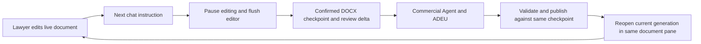

# LQ Commercial Redlining MVP — discovery and implementation plan

Status: **Windows handoff prepared; product implementation has not begun.** Source discovery was completed on 1 October 2026. On 6 October the user directed a handoff to their personal Windows PC through `sarturko-maker/deepseek-legal`. This supersedes the 2 October Web-first route. This is the single current implementation plan; [WINDOWS_HANDOVER.md](WINDOWS_HANDOVER.md) provides continuation instructions. The current authorization covers repository preparation and pushing to that destination. Product implementation awaits approval; an instruction to continue implementation on Windows supplies that approval.

**Recommendation and the decision to approve**

Build a shared Harness integration that owns one continuing document session, displays a live Collabora CODE editor beside chat, and calls the pinned ADEU Node SDK for tracked amendments. Develop and test directly in Harness Desktop on the user's personal Windows PC, using its ordinary supported Windows launch path. Collabora supplies the interactive LibreOffice-based editor. Harness keeps its chat, sessions, permissions, model connection and extension mechanisms. The application coordinates the document automatically when the lawyer sends the next instruction.

**Windows Desktop is the primary development and acceptance environment.** Linux platform support, Linux Desktop launcher changes, Wine, Xvfb and Linux runtime-target workarounds are outside this MVP. A preliminary Web implementation or separate Web acceptance milestone is no longer required. Use Harness's shared client/host extension points for the coordinator, ADEU adapter, skill and playbook; use Web only if useful for a bounded diagnostic. Do not create a replacement chat application. Signed installers, updater work and enterprise deployment are unnecessary for the personal Windows experiment.

The critical proof is the repeated human–agent loop, including unsaved editor state, resolved revisions and export. Neither inspected Harness nor the LQ fork already meets that complete requirement. Run the full substantive acceptance sequence inside Windows Desktop. The handoff adds instructions and this plan to the unchanged Harness baseline; no redlining integration, live-model test or GUI acceptance result is included. Windows support is established by upstream source; successful launch on the user's particular PC must still be observed.

**Verified environment, repositories and discovery assignments**

Discovery ran on a Debian 12 x86_64 laptop, not Windows. Its old resource measurements, local paths and installed tools are not Windows prerequisites. Existing LQ services and user modifications were preserved. No Windows environment has yet been inspected or exercised. The next agent should inspect the personal Windows PC once, record its native OS/architecture and tool versions, and use normal upstream Desktop setup. Do not repeat Linux compatibility discovery.

| Project | Inspected checkout and state | Exact commit / relevant versions |
|---|---|---|
| DeepSeek Harness | Official upstream `master` inspected during discovery; this repository is based on the same pinned source and retains its upstream Git history | `639ed015397290b3745d163aafe02ffee4aa3f84`; tag `dsh-v0.2.0-rc.2`; Desktop 0.2.0-rc.2; lockfile Electron 44.0.0; pnpm 11.7.0 |
| ADEU | Official `main` inspected in an isolated checkout; source is a reference, not copied into this handoff | `965736d2d8ea32f42ed9a2a0a01b3c5a538f7f75`; Python `adeu` and Node `@adeu/core` both 3.0.6 |
| LQ fork | Verified user fork `sarturko-maker/lq-ai-fork`, `main`; tracked source was clean; reference only | `82904157a155ad2926e4ba64447087f7ef1cdb45`; current ADEU pin 2.4.0; Collabora CODE 26.04.1.4 |

On 1 October all three repository HEADs matched the inspected commits after network access was granted. Harness's upstream branch is `master`; the handoff branch is `main`. Two older ADEU checkouts were identified before using 3.0.6. Eleven pre-existing untracked paths in the LQ fork were left untouched and are not included here. Temporary discovery checkouts are not required for continuation: use the pinned source references below. On 6 October the Harness tag was cloned again and its exact commit verified before preparing this handoff.

Applicable home/repository instructions were read, including Harness's scoped instructions and the fork's CLAUDE.md and HANDOFF. The explicit discovery-only brief governs this work; no legacy memory workflow or unrelated LQ application requirements were imported.

During the 1 October discovery, model selection was verified in both configuration and actual session metadata: the orchestrator ran on `gpt-6-astra`, reasoning `max`; each of the three named discovery agents ran on `gpt-6-luna`, reasoning `high`. Explicit spawn parameters selected those models. No main-session model switch was attempted. The available model catalogue describes Astra as the frontier model and Luna as the cheaper model for bounded work. The requested [Codex best practices](https://learn.chatgpt.com/guides/best-practices) and [subagent guidance](https://learn.chatgpt.com/docs/agent-configuration/subagents) were consulted. Findings below consolidate all three reports and the orchestrator's independent checks.

**What the projects actually provide**

| Project | Implemented capabilities and evidence | Missing for this MVP |
|---|---|---|
| Harness | Electron wraps the shared Harness application. Workspaces, ordinary sessions, agent presets, filesystem skills, client slots, host routes and turn hooks already exist. DOCX is converted to PDF in the right sidebar. [Desktop](https://github.com/deepseek-ai/deepseek-harness/blob/639ed015397290b3745d163aafe02ffee4aa3f84/apps/desktop/README.md), [preview](https://github.com/deepseek-ai/deepseek-harness/blob/639ed015397290b3745d163aafe02ffee4aa3f84/packages/client/ui-sidebar-documentpreview/README.md#L28), [skills](https://github.com/deepseek-ai/deepseek-harness/blob/639ed015397290b3745d163aafe02ffee4aa3f84/packages/skill/skill-filesystem/README.md) | Interactive Word editing, revision management, editor-to-turn handover and review continuity. A rendered PDF is neither an editable DOCX nor an accept/reject interface. The preview adds no document context to the model. |
| ADEU | Reads the original DOCX package, projects text/revisions/comments for the model, and applies targeted edits as native OOXML tracked changes. Node exports `DocumentObject` and `RedlineEngine`; `process_batch` supports transactional failure handling. [Exports](https://github.com/dealfluence/adeu/blob/965736d2d8ea32f42ed9a2a0a01b3c5a538f7f75/node/packages/core/src/index.ts), [package load/save](https://github.com/dealfluence/adeu/blob/965736d2d8ea32f42ed9a2a0a01b3c5a538f7f75/node/packages/core/src/docx/bridge.ts#L158), [batch API](https://github.com/dealfluence/adeu/blob/965736d2d8ea32f42ed9a2a0a01b3c5a538f7f75/node/packages/core/src/engine.ts#L4878) | Live editor coordination, turn ownership, stale-write prevention and a durable account of human review outcomes. It cannot see unsaved Collabora state. |
| LQ fork | A Collabora iframe beside chat; WOPI reads/saves; native redlines; saved-byte rereading; file locks, timestamp/hash checks and snapshots. A hand-back button requests a save, closes the editor and primes chat. [Editor](https://github.com/sarturko-maker/lq-ai-fork/blob/82904157a155ad2926e4ba64447087f7ef1cdb45/web/src/lib/lq-ai/components/matter/DocumentEditorPanel.svelte#L483), [WOPI](https://github.com/sarturko-maker/lq-ai-fork/blob/82904157a155ad2926e4ba64447087f7ef1cdb45/api/app/api/wopi.py#L419), [document reread](https://github.com/sarturko-maker/lq-ai-fork/blob/82904157a155ad2926e4ba64447087f7ef1cdb45/api/app/agents/review_edited_document_tools.py#L267) | Ordinary chat does not automatically flush the editor. No explicit accept/reject action journal exists. Editing is not exclusively coordinated with an agent run. Download returns stored bytes, so an unsaved editor still needs a barrier. |

Harness's separately packaged LibreOffice Kit is a conversion provider. Its browser-worker replacement rejects converter creation; neither is a hidden interactive editor. See [conversion limitations](https://github.com/deepseek-ai/deepseek-harness/blob/639ed015397290b3745d163aafe02ffee4aa3f84/packages/document/office-to-pdf/README.md) and [worker stub](https://github.com/deepseek-ai/deepseek-harness/blob/639ed015397290b3745d163aafe02ffee4aa3f84/packages/experimental/webworker-runtime/src/node/external_packages/libreoffice-kit.ts).

ADEU's Node SDK is the recommended integration: version 3.0.6 requires Node 22 or later, already covered by Harness's stronger runtime requirement, and adds only `fflate` and `diff-match-patch` as runtime dependencies. Use its existing projection, change/comment readers and engine; do not introduce MCP's separate document/session lifecycle or reconstruct the contract from flattened text. Explicitly set the agent author and use `partial=false`. Engine-local `Chg:N`/`Com:N` references must be regenerated from each current document, not retained as durable identities. [Manifest](https://github.com/dealfluence/adeu/blob/965736d2d8ea32f42ed9a2a0a01b3c5a538f7f75/node/packages/core/package.json), [existing-comment regression](https://github.com/dealfluence/adeu/blob/965736d2d8ea32f42ed9a2a0a01b3c5a538f7f75/node/packages/core/src/engine.comment-preservation.test.ts).

Fidelity is qualified, not universal. ADEU serializes XML package parts on save; byte-identical XML is not a valid general preservation promise. Text boxes/SmartArt are absent from its projection, some objects are read-only, comments are restricted to the main story, and URL retargeting is not tracked. Existing opaque content must survive, and the agent must be told about unread or unsupported regions. Initially exclude agent operations such as silent URL retargeting that cannot meet the tracked-amendment requirement. [ADEU fidelity contract](https://github.com/dealfluence/adeu/blob/965736d2d8ea32f42ed9a2a0a01b3c5a538f7f75/docs/FIDELITY.md).

The fork provides useful patterns, not components to import wholesale: iframe lifecycle, WOPI version checks, snapshot-before-write, and rereading current marked-up bytes. Its matter roster, gateway, memory, database, audit framework and authentication stack are unnecessary here. Source is more reliable than its older proposals: the current editor sends `Action_Save` without `Notify:true`, and its save-state helper can treat a non-error response as saved. That is insufficient evidence for our handover barrier. [Save-state helper](https://github.com/sarturko-maker/lq-ai-fork/blob/82904157a155ad2926e4ba64447087f7ef1cdb45/web/src/lib/lq-ai/api/editor.ts#L98).

**Windows Desktop integration and editor arrangement**

Use the existing shared right-sidebar tab/slot extension points for a stable, session-owned editor pane beside chat in Harness Desktop. Reuse the layout, but give the live editor its own lifecycle: the PDF preview's automatic file reload must not remount an iframe with unsaved work. One Commercial Agent preset loads the commercial skill and selected Markdown playbook. A host plugin owns the working-document session, ADEU tools, WOPI adapter and handover. Keep integration code on Harness's shared client/host interfaces, adding Desktop-specific wiring only where an observed integration requirement needs it. There is no replacement chat, new account system or long-term memory service.

Run one isolated, pinned Collabora CODE service for this experiment. Start with image digest `sha256:75859dc9f9084d1877ce36cf96ec86600f495bade33289c9cbc27e0a0ee23b81` (26.04.1.4), whose running version was verified in the old LQ environment. Prepare a separate instance on Windows using a suitable Linux-container runtime; do not depend on the old laptop's running stack. Embed the live editor inside Harness Desktop using an application-owned local wrapper/bridge. Collabora must explicitly allow the configured embedding origin; validate postMessage origin and source. Preserve Electron's sandbox, context isolation and web security.

Collabora's browser assets and WebSocket paths need real HTTP routing; Docker must also reach the WOPI callback endpoint. Use Harness's existing host route mechanisms and add only the narrowly scoped editor/WOPI bridge they require, without exposing the entire Harness host. Use WOPI's scoped document capabilities and version checks, not new user accounts. Verify native Windows host/container routing, iframe communication, Desktop's authenticated `dsh-app://app` forwarding and late-save fencing directly in Desktop. These are requirements of embedding the live document editor, not reasons to alter upstream Windows launch or build-target support. Keep any necessary configuration or adapter small. Existing [host route APIs](https://github.com/deepseek-ai/deepseek-harness/blob/639ed015397290b3745d163aafe02ffee4aa3f84/packages/host/webserver/src/index.ts#L38) and the fork's [real asset/WebSocket findings](https://github.com/sarturko-maker/lq-ai-fork/blob/82904157a155ad2926e4ba64447087f7ef1cdb45/docs/fork/evidence/libreoffice-slice4/README.md) support this approach; exact deployment wiring remains a Phase 1/2 verification item.

The earlier Linux Desktop limitation is historical context only. `dev.ts` calls a target resolver that rejects `linux-x64`; the orchestrator reproduced that error during discovery. The selected Windows x64 target is supported. Leave the launcher and resolver unchanged and start with `pnpm run dev:desktop` on native Windows. [Rejecting resolver](https://github.com/deepseek-ai/deepseek-harness/blob/639ed015397290b3745d163aafe02ffee4aa3f84/apps/desktop/scripts/desktop-build-paths.mjs#L7), [development call](https://github.com/deepseek-ai/deepseek-harness/blob/639ed015397290b3745d163aafe02ffee4aa3f84/apps/desktop/scripts/dev.ts#L115).

Native LibreOffice window embedding would add platform-specific integration with no equivalent implemented Harness path; external launching loses the integrated experience; Harness's conversion kit provides preview only. The chosen route is development and acceptance directly in Windows Desktop. It requires real interactive editing alongside chat; a CLI-only test, static preview or external editor does not satisfy the GUI milestone.

**Automatic awareness and safe handover**

Preserve the original byte-for-byte and create an application-owned working copy. The lawyer sees one stable document name/tab. Checkpoints and editor generations remain internal. The coordinator is the only writer to the managed document; the Commercial Agent's general tools must not bypass it or write the original. Use Harness's existing permission mechanisms for this restriction.

The proposed handover is automatic:

1. **Gate the turn.** On the next lawyer instruction, pause document editing visibly and drain pending input. Capture active text composition and comment editing as well as changes already in the LibreOffice model. The host must withhold document-dependent model/tool work until this succeeds. Human editing alone never starts an agent task.
2. **Flush and confirm.** Request an editor save with notification and wait for a successful, correlated save plus the host's durable WOPI checkpoint. A timer, an old file modification time or a `dirty=false` notification alone is insufficient. Handle a no-change save explicitly. If the editor changes during flushing, repeat the barrier before taking the checkpoint.
3. **Transfer ownership.** Once the latest bytes are preserved, retire/fence the editor generation and acquire the agent's exclusive document lease. Do not leave an old in-memory Collabora document able to overwrite the new output. Keep editing paused during the agent turn for the first MVP; show progress and cancellation.
4. **Supply current context automatically.** Read that exact DOCX through ADEU and provide current text, outstanding revisions/comments, the human delta and prior review outcomes with the lawyer's instruction. Record model-visible context through Harness's normal session logging. `agent/pre-step` is the existing admission seam; it runs at multiple steps, so the plugin must scope acquisition to the requested turn and reuse its lease thereafter. System assembly precedes this hook: inject the current document into the admitted message batch, not a system-prompt provider that has already run. [Actual hook order](https://github.com/deepseek-ai/deepseek-harness/blob/639ed015397290b3745d163aafe02ffee4aa3f84/packages/core/agent-loop/src/agent.ts#L267).
5. **Prepare, check and publish.** ADEU works on a staged copy of the checkpoint. Validate the complete batch, DOCX integrity, preserved protected content and expected revisions/comments. Publish only if the document hash and ownership generation still match. On a mismatch, preserve both states and refresh/re-plan; never apply an old patch blindly.
6. **Return the same document.** Open the committed generation automatically in the same pane, verify it loaded the expected version, then restore editing. Internal WOPI identities may change to avoid a cached old document, but the lawyer must never select a version or open a numbered output. Restore location where practical; retain checkpoints because editor undo history may reset across reloads.

On save timeout or editor failure, leave unsaved work in the editor and stop the dependent turn; preserve the chat instruction. On ADEU/model failure, keep the last human checkpoint. On a late old-generation save, retain its bytes for recovery and reject publication to the working head. On reload failure, keep the committed output and previous checkpoint and show a retryable error. Closing the document or exporting uses the same save barrier. A crash cannot guarantee recovery of keystrokes never delivered anywhere; the application must report the last confirmed checkpoint rather than claim synchronization.

**Human review decisions need their own session evidence**

A current DOCX by itself is inadequate. Retain each agent proposal's before/after wording, affected document part and contextual anchors, revision grouping, author and baseline checkpoint *before* exposing it for review. At each handover, reconcile this ledger against the newly captured DOCX, including untracked human edits and comments. Do not identify a proposal solely by an OOXML or ADEU numeric ID: LibreOffice can renumber or regroup revisions.

For an unambiguous proposal, retained proposed wording with the corresponding revision resolved is an **accepted outcome**; restoration of its prior wording with the proposal gone is a **rejected outcome**. Label these as outcomes established from observed before/after state, not invented evidence of a particular button click. A changed or partially resolved proposal becomes **human-modified/resolved, exact action uncertain** when the evidence does not support a stronger conclusion. Undo/redo must reconcile the current outcome rather than preserve a stale rejection flag.

This approach uses both the earlier proposal and later editor state: it does not ask the model to infer decisions from current wording alone. Import/re-save normalization needs its own baseline so it is not mistaken for a lawyer decision. Track history only from the observed session; pre-existing revisions arrive as pending/unknown history.

All human-modified or resolved spans are protected by default, including uncertain cases. Give the agent this evidence on every relevant turn; prevent automatic replay of retired proposals and check candidate patches against protected spans. A later explicit instruction may supersede a decision. Only an actual conflict that cannot be resolved from that instruction should require clarification; uncertainty elsewhere must not turn routine handover into a dialogue.

**This reconciliation is a feasibility gate, not an already proven capability.** Test accept, reject, partial resolution, manual rewriting, unchanged wording after rejection, renumbering, duplicate text and undo/redo. The fork has no reliable accept/reject event feed. Collabora's current [WOPI handler](https://raw.githubusercontent.com/CollaboraOnline/online.mirror/main/browser/src/map/handler/Map.WOPI.js) supports notified saves and UNO dispatch, but that does not establish a stable decision log in the pinned build; its public [UNO result issue](https://github.com/CollaboraOnline/online/issues/8903) also leaves this uncertain. If outcome reconciliation cannot reliably protect the mandatory journey, a small pinned editor observation adapter must be evaluated before proceeding. Do not substitute guessed action history, a manual change summary, or a weaker acceptance test.

**Skill, playbook, scope and data handling**

Use one reusable commercial `SKILL.md` through Harness's filesystem skill provider, plus an editable Markdown example playbook. It will define review positions and cite its selected reviewing party/stance separately from integration instructions. For the synthetic demonstration, propose an explicitly labelled customer-side, balanced playbook covering liability and indemnity plus one simple secondary clause. The UI/session records that selection; real reviewing positions must be provided rather than inferred. Playbook edits take effect without rebuilding and are captured at the start of a turn.

The skill requires current-document tools, minimal genuine tracked amendments, preservation of human decisions and escalation of real conflicts. It must not reconstruct contracts from plain text, accept all changes, or silently produce a clean copy. Start with tracked DOCX export only; a clean-copy feature is unnecessary for the MVP. Enable and verify human change recording in the editor, but also detect untracked edits rather than depending on the recording flag alone. Use distinct agent and lawyer authors where the document format/editor preserves them.

No additional legal agents, matter management, retrieval, email, long-term memory, authentication system, analytics, telemetry or Linux platform-support work are proposed. Normal Harness session persistence remains intact. The session ledger/checkpoints exist only for document coordination and recovery. Small modules should normally stay around 200 hand-maintained lines; keep any necessary larger protocol/state-machine module cohesive and explain the exception.

Document processing and Collabora run locally; the Commercial Agent's document text, comments and instructions go to the selected model service. The recommended first smoke uses Harness's existing DeepSeek connection, whose official API root in this checkout is `https://api.deepseek.com/anthropic`; account/custom routes must be identified if selected instead. This is not an offline application. Harness also has existing optional session-log upload, enabled by default in shipped profiles. Record/configure those existing controls for the test profile; add no new collection. [Provider](https://github.com/deepseek-ai/deepseek-harness/blob/639ed015397290b3745d163aafe02ffee4aa3f84/packages/llm/llm-deepseek/README.md#L82), [session-log setting](https://github.com/deepseek-ai/deepseek-harness/blob/639ed015397290b3745d163aafe02ffee4aa3f84/packages/session/session-log-deepseek/README.md#L28).

Harness and ADEU are MIT; LQ code is Apache-2.0, with notices retained for any narrow reuse. Collabora source and its LibreOffice core have open-source licence obligations; official CODE binaries, branding and third-party components need their own terms checked. The publisher presents CODE for development/testing, which fits the local experiment. Keep its notices/branding intact and install the pinned image as a prerequisite rather than bundling it in a GitHub handoff. The fork's notices are not independent clearance for binary redistribution or enterprise production. Applicable terms for a corporate sandbox and any later distribution remain a Phase 4 check. [Collabora source licence](https://github.com/CollaboraOnline/online/blob/main/COPYING), [LibreOffice licensing](https://www.libreoffice.org/licenses/), [publisher's CODE page](https://www.collaboraonline.com/de/code/), [publisher's binary-licensing discussion](https://forum.collaboraonline.com/t/code-binary-license/179).

**Phases, observable outcomes and acceptance**

| Phase | User-visible outcome | Work and verification | Acceptance criteria |
|---|---|---|---|
| **1 — Establish the native Windows Desktop baseline** | Unmodified Harness Desktop opens on the personal Windows PC; ordinary chat, workspace selection and existing DOCX preview can be inspected before adding editing. | Inspect Windows/architecture and normal prerequisites. Use this pinned checkout, supported Node/pnpm and the existing `dev:desktop` command. Record actual GUI launch, model connection, file access and any pre-existing failure separately. Prepare the isolated Collabora prerequisite when needed for Phase 2. | Native Windows Desktop launch, workspace open and baseline preview observed. Model connection evidence is separate from keyless checks. No Linux adaptation, Web-first requirement, signing or packaging work. Existing permission controls and ordinary sessions remain intact. |
| **2 — Prove the complete editing round trip in Desktop** | Chat and the live editable contract remain side by side in Desktop; the next instruction automatically hands current human work to the agent and returns the continuing document. | Add small shared client/host plugins, coordinator, local Collabora/WOPI bridge, ADEU adapter, skill and playbook. First run controlled amendments through real ADEU and the real embedded editor. Prove notified durable saving, review-outcome reconciliation and old-session fencing early. Then use the live Commercial Agent with a synthetic contract. | At least three agent turns: first redline; substantive human edit + accept + reject + comment without manual save; dependent indemnity instruction; another human edit and agent turn; tracked export and reopen. Rejected proposals stay rejected by default, human wording/comments and outstanding revisions survive, and the original hash is unchanged. Record native Windows Desktop and live-model evidence. |
| **3 — Reliability and your personal Windows test** | You can perform the complete journey on your personal Windows PC and recover from a failed handover without losing work. | Add focused deterministic regressions, real ADEU/Collabora preservation tests and failure injection. Independently review document safety and handover. Exercise Windows focus/keyboard, file dialogs, export paths and editor/container routing. Give concise test steps, observe your personal test, fix issues and repeat affected checks. | Relevant checks and the full hands-on Desktop acceptance test succeed after fixes. Separate automated, GUI and live-model evidence. Ordinary redlining downloads no packages. A mocked editor notification or successful first redline cannot establish acceptance. |
| **4 — Reproduce and prepare the later corporate handoff** | A clean Windows checkout reproduces the accepted workflow; the repository explains what a later corporate sandbox needs. | Verify setup in a clean native Windows checkout using the same versions. Maintain this plan, setup instructions and coherent commits. Record notices and dependency prerequisites. Document corporate container/virtualization and network requirements separately; exercise that environment only when available. | Clean-checkout setup and the accepted native Windows journey are reproducible. Record OS/build/revision and all untested environments. Personal Windows success does not establish corporate sandbox or macOS compatibility. Git excludes credentials, real documents, generated outputs and machine-specific runtime paths. Signed installers and enterprise infrastructure are unnecessary. |

The initial GitHub source-and-plan handoff is authorized now; it does not mean Phase 4 product reproducibility or acceptance is complete. After implementation approval, use a feature branch and review each increment's diff and relevant checks. Keep parallel implementation work disjoint. Independently review the completed workflow for lost edits, stale state, review continuity and export. Do not defer actual Desktop testing: Windows is available as the next development environment. macOS and a separate Web acceptance run are not required for this personal Windows MVP.

**Verification matrix and outstanding risks**

| Behaviour | Required evidence |
|---|---|
| Original and native revisions | SHA-256 of the untouched original; actual ADEU-produced `w:ins`/`w:del`; editor visibly displays revisions; distinct human/agent authors checked. |
| Existing document content | Synthetic corpus with pre-existing revisions/comments, mixed run formatting, numbering, tables, headers/footers, fields, links and an embedded image. Assert semantic/structural preservation and inspect representative layout after repeated actual saves. Unsupported complex constructs are surfaced, not silently stripped. |
| Current unsaved human state | Real editor typing immediately before ordinary chat submission, including active composition/comment handling; verify the checkpoint and model's supplied context contain it without a manual save. |
| Review decisions | Accept one proposal and reject another; verify the next turn's ledger and output. Include reject-to-original wording, partial changes, untracked edits, duplicate spans, renumbering and undo/redo. Never equate a missing revision ID alone with rejection. |
| No lost edits | Attempt typing during preparation, delayed/duplicate WOPI saves, stale hash, a second session opening the same working document and external modification. One writer owns the document; competing bytes survive and cannot silently replace the head. |
| Failures | Save failure/timeout, interrupted connection, unavailable renderer, failed ADEU batch, model cancellation/failure, stale writer and reload failure. Keep a usable checkpoint, pending instruction and honest state indication. |
| Continuity/export | At least three rounds, then export with another unsaved edit. Reopen the exported DOCX in the interactive editor and independently inspect its text, remaining revisions/comments and original hash. Export never invokes accept-all. |
| Actual agent behaviour | Separate live-model run showing the indemnity uses the lawyer's current liability provision and obeys recorded review outcomes. Deterministic document tests do not establish model compliance. |
| Windows Desktop acceptance | Execute the complete substantive journey inside actual Harness Desktop on the personal Windows PC. Record OS/build, integration revision, model service and engine versions, including file/origin/permission behaviour. Automated, live-model and hands-on GUI evidence remain distinct. Web tests, if used diagnostically, do not replace this acceptance. |

Complex DOCX preservation is still unproven for the chosen ADEU 3.0.6 + CODE 26.04.1.4 pairing. The fork records four headless Collabora round-trip fixtures using ADEU **1.12.1**, plus a later real WOPI edit/save demonstration. Its hand-back test injected an editor status and explicitly did not run the full provider-backed resumed workflow. Those historical results justify trying Collabora but do not pass this plan's gates. [Old fidelity evidence](https://github.com/sarturko-maker/lq-ai-fork/blob/82904157a155ad2926e4ba64447087f7ef1cdb45/docs/fork/evidence/libreoffice-spike0/README.md), [hand-back test limits](https://github.com/sarturko-maker/lq-ai-fork/blob/82904157a155ad2926e4ba64447087f7ef1cdb45/docs/fork/evidence/libreoffice-slice5/SUMMARY.md).

During 1 October discovery, environment/repository checks and the Desktop target-resolver probe ran. An ADEU Python regression attempt stopped during collection because `rapidfuzz` was absent; it is not a pass. Node tests, the current ADEU–Collabora round trip, live-agent tests and GUI acceptance were not run. The 2 October Web route is superseded by the 6 October Windows handoff. No implementation or Windows launch occurred while preparing the handoff. Source inspection does not establish a passed test.

The Collabora SDK site was inaccessible behind its bot-check page. Public source from Collabora's mirror established available protocol concepts, but the pinned image's precise save/close behaviour still needs the Phase 2 empirical check. Review-outcome mapping, browser draft flushing, old-session fencing and document fidelity are the highest-priority gates. They cannot be deferred until packaging.

**What you will need on the personal Windows PC**

Use native Windows x64, Git, a supported Node runtime (the checked-in Harness runtime lock pins Node 24.21.0) and pnpm 11.7.0. Follow [the Windows handover](WINDOWS_HANDOVER.md), [upstream setup](docs/development.md#setup-tutorial) and [Desktop development](apps/desktop/README.md#develop). Keep the checkout and its dependencies on the Windows filesystem. Use the normal upstream Desktop development command and its isolated development profile. Do not set up Harness inside WSL or add Linux launch support. Any native build prerequisite should follow an actual upstream requirement or installation diagnostic, not speculative platform changes.

Collabora CODE remains a separate integration prerequisite: normal Harness Desktop has document preview, not this interactive contract editor. Use a suitable local Linux-container runtime such as Docker Desktop, with its normal virtualization/backend prerequisites. WSL may be used by that container backend; this does not move Harness development into Linux or authorize Linux Desktop support. Use a dedicated experiment container, pin the image and verify its callback access to the native Windows host. ADEU Node needs neither an additional Python service nor a standalone host LibreOffice installation. Prepare packages and editor dependencies during setup, before ordinary redlining.

You will need an existing Harness model connection and a synthetic DOCX. Configure credentials through normal local controls; never place them in this repository. The example playbook must explicitly identify the reviewing party and stance. The full personal test includes the unsaved edit/accept/reject/comment sequence, the dependent chat instruction, another editing round, and export/reopen. No manual save, synchronization, intervention summary or version selection is allowed. All those GUI steps remain pending.

The next machine is the user's **personal Windows PC**, not the corporate sandbox. Corporate prerequisites and licensing are a later handoff concern. When that separate test is scheduled, verify whether its sandbox permits the required container runtime, virtualization and networking; do not assume Windows Sandbox permits nested Docker/WSL. Docker's [Windows installation requirements](https://docs.docker.com/desktop/setup/install/windows-install/) are the starting reference, with current terms to be checked at setup. A remote editor service requires a separately approved choice and explicit data-flow implications. Do not add corporate deployment infrastructure to the personal experiment.

**Authorization and progress**

| Item | Status |
|---|---|
| Three source discovery reports, configuration verification and consolidated architectural review | Complete on 1 October |
| Direction: native Desktop development and testing on the personal Windows PC | Confirmed by the user on 6 October; supersedes the Web-first route |
| Handoff destination | `https://github.com/sarturko-maker/deepseek-legal`; push authorized by the user; already public when inspected; visibility left unchanged |
| Pinned upstream Harness source and Windows continuation instructions | Prepared for the authorized handoff; product source remains unchanged |
| Linux Desktop adaptation, mandatory Web-first work, platform workarounds | Excluded |
| Phases 1–3, integration and personal Windows acceptance | Not completed |
| Phase 4, clean Windows reproduction and corporate sandbox verification | Not completed |

The current task prepares and publishes this handoff only. Begin with normal native Windows Desktop baseline verification in the next project. Product implementation follows approval of this plan or an explicit instruction to continue implementing it; do not repeat a permission request once that authorization has been given. The destination authorization covers this repository, not another destination or changes to visibility. Keep ordinary Harness behaviour and the user's existing work intact. Implementation has not begun.
